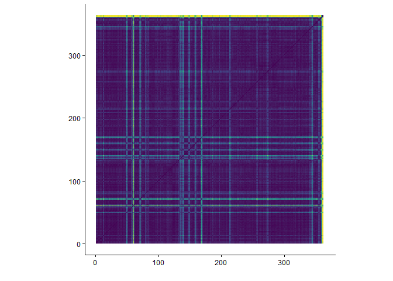
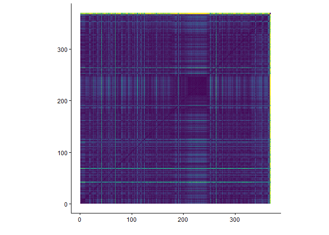

```{r imports}
library(plotly)
library(tidyverse)
library(compmus)
library(tidymodels)
library(ggdendro)
library(heatmaply)
```


---
title: "ATW"
sidebar: atw
format:
  html:
    theme: quartz
---

```{r setup, include=FALSE}
knitr::opts_chunk$set(echo = FALSE)
```

## Introduction

Each album analysis page has the exact same layout, that is:<br>
- Album Information<br>
- Metadata<br>
- Clustering<br>
- Harmony<br>
- Tempo<br>
- Timbre<br>
- Structure<br>
- Conclusion<br><br>

### Album Information

Released by New West Records on 24-2-2017 <br>
Genres according to database MusicBrainz<br>
- Blues rock
- Psychedelic rock
- Hard rock
- Neo-psychedelica
- Rock<br><br>
Producer: Ben McLeod<br>
Songwriting credits:<br>
- Charles Michael Parks Jr. - Vocals, Bass guitar and Loops<br>
- Jonathan Draper - Rhodes Piano, Organ, Synthesizers and Percussion<br>
- Ben McLeod - Electric Guitar and Acoustic Guitar<br>
- Robby Staebler - Drums, Percussion and Loops<br>
<br>

### Metadata

This album features 8 tracks, with an average duration of 6 minutes and 29 seconds. The track list below shows the length of each track in minutes.

```{r}
alltracks <- read_csv("computational_musicology_alltracks.csv")

alltracks <- alltracks %>%
  rename(duration = `Duration (ms)`)

atw_data <- "ATW"

atw_df <- alltracks %>%
  filter(`Album Name` == "ATW") %>%
  mutate(
    duration_min = duration / 60000,
    duration_label = sprintf(
      "%d:%02d",
      duration %/% 60000,
      (duration %% 60000) %/% 1000
    )
  )

atw_df <- atw_df %>%
  mutate(`Track Name` = factor(`Track Name`, levels = `Track Name`))

ggplot(atw_df, aes(x = duration_min, y = forcats::fct_rev(`Track Name`))) +
  geom_col(fill = "#EB2E84") +
  geom_text(aes(label = duration_label), hjust = -0.1, size = 3) +
  labs(
    title = "Duration per Track",
    x = "Duration (minutes)",
    y = "Track"
  ) +
  theme_minimal() +
  xlim(0, max(atw_df$duration_min) * 1.1)
```

The average tempo of this album is 118bpm with a minimum of 63bpm and a maximum of 153bpm. The track list below shows the tempo of each track in bpm.

```{r}
alltracks %>%
  filter(`Album Name` == "ATW") %>%
  group_by(`Album Name`) %>%
  mutate(`Track Name` = factor(`Track Name`, levels = rev(unique(`Track Name`)))) %>%
  ungroup() %>%
  ggplot(aes(x = `Track Name`, y = Tempo)) +
  geom_col(fill = "#EB2E84") +
  coord_flip() +
  labs(
    x = "Track",
    y = "Tempo (BPM)",
    title = "Tempo per Track"
  ) +
  theme_minimal()
```

## Clustering

To analyze six albums within the scope of this course, clustering is used to select two representative tracks per album for deeper analysis. A hierarchical clustering tree is shown below, based on the following variables: danceability, energy, key, loudness, mode, speechiness, acousticness, instrumentalness, liveness, valence, tempo, duration, and time signature. Popularity is excluded, as it does not reflect the audio characteristics of the tracks. From each of the two primary clusters, the most streamed track is selected.<br><br>
The resulting clusters reflect distinct musical characteristics. The tracks in cluster one have a clear pulse and structurally sound and feel like jam sessions. Cluster two, on the other hand, consists mostly of tracks with big build-ups and climaxes. They sound clean and calm at first, but work up to parts with big solos, a change in feel, or more experimental or empty sounding ends after the climax. The most streamed track in cluster one is *Fishbelly 86 Onions* and the most streamed track in cluster two is *Diamond*.

```{r}
atw_juice <-
  alltracks %>%
  filter(`Album Name` == "ATW") %>%
  mutate(`Track Name` = str_trunc(`Track Name`, 36)) %>%
  recipe(
    `Track Name` ~
      Danceability +
      Energy +
      Loudness +
      Speechiness +
      Acousticness +
      Instrumentalness +
      Liveness +
      Valence +
      Tempo
  ) |>
  step_center(all_predictors()) |>
  step_scale(all_predictors()) |> 
  prep() |>
  juice() |>
  column_to_rownames("Track Name")

atw_dist <- dist(atw_juice, method = "euclidean")

atw_dist |> 
  hclust(method = "complete") |> 
  dendro_data() |>
  ggdendrogram()
```

## Harmony

Chromagram - *Fishbelly 86 Onions*<br><br>
As seen in the plot below, the most dominant pitch of this track is the G, consistently, along with the Bb, F, D and C. This track consists of a single riff that is repeated over and over again, which results in a consistent dominant pitch.

```{r}
fishbelly <- read_csv("dat/fishbelly.csv")

fishbelly |>
  compmus_wrangle_chroma() |> 
  mutate(pitches = map(pitches, compmus_normalise, "euclidean")) |>
  compmus_gather_chroma() |> 
  ggplot(
    aes(
      x = start + duration / 2,
      width = duration,
      y = pitch_class,
      fill = value
    )
  ) +
  geom_tile() +
  labs(x = "Time (s)", y = NULL, fill = "Magnitude") +
  theme_minimal() +
  scale_fill_viridis_c()
```

Chromagram - *Diamond*<br><br>
As seen in the plot below, the most dominant pitches are the A and D throughout the whole track. The pitches F#, F ,C and E form a pattern that repeats itself seven times, which is caused by the electric guitar riff with only the accompaniment of a single bass pitch and simple drums.

```{r}
diamond <- read_csv("dat/diamond.csv")

diamond |>
  compmus_wrangle_chroma() |> 
  mutate(pitches = map(pitches, compmus_normalise, "euclidean")) |>
  compmus_gather_chroma() |> 
  ggplot(
    aes(
      x = start + duration / 2,
      width = duration,
      y = pitch_class,
      fill = value
    )
  ) +
  geom_tile() +
  labs(x = "Time (s)", y = NULL, fill = "Magnitude") +
  theme_minimal() +
  scale_fill_viridis_c()
```


```{r}
circshift <- function(v, n) {
  if (n == 0) v else c(tail(v, n), head(v, -n))
}

#      C     C#    D     Eb    E     F     F#    G     Ab    A     Bb    B
major_chord <-
  c(   1,    0,    0,    0,    1,    0,    0,    1,    0,    0,    0,    0)
minor_chord <-
  c(   1,    0,    0,    1,    0,    0,    0,    1,    0,    0,    0,    0)
seventh_chord <-
  c(   1,    0,    0,    0,    1,    0,    0,    1,    0,    0,    1,    0)

major_key <-
  c(6.35, 2.23, 3.48, 2.33, 4.38, 4.09, 2.52, 5.19, 2.39, 3.66, 2.29, 2.88)
minor_key <-
  c(6.33, 2.68, 3.52, 5.38, 2.60, 3.53, 2.54, 4.75, 3.98, 2.69, 3.34, 3.17)

chord_templates <-
  tribble(
    ~name, ~template,
    "Gb:7", circshift(seventh_chord, 6),
    "Gb:maj", circshift(major_chord, 6),
    "Bb:min", circshift(minor_chord, 10),
    "Db:maj", circshift(major_chord, 1),
    "F:min", circshift(minor_chord, 5),
    "Ab:7", circshift(seventh_chord, 8),
    "Ab:maj", circshift(major_chord, 8),
    "C:min", circshift(minor_chord, 0),
    "Eb:7", circshift(seventh_chord, 3),
    "Eb:maj", circshift(major_chord, 3),
    "G:min", circshift(minor_chord, 7),
    "Bb:7", circshift(seventh_chord, 10),
    "Bb:maj", circshift(major_chord, 10),
    "D:min", circshift(minor_chord, 2),
    "F:7", circshift(seventh_chord, 5),
    "F:maj", circshift(major_chord, 5),
    "A:min", circshift(minor_chord, 9),
    "C:7", circshift(seventh_chord, 0),
    "C:maj", circshift(major_chord, 0),
    "E:min", circshift(minor_chord, 4),
    "G:7", circshift(seventh_chord, 7),
    "G:maj", circshift(major_chord, 7),
    "B:min", circshift(minor_chord, 11),
    "D:7", circshift(seventh_chord, 2),
    "D:maj", circshift(major_chord, 2),
    "F#:min", circshift(minor_chord, 6),
    "A:7", circshift(seventh_chord, 9),
    "A:maj", circshift(major_chord, 9),
    "C#:min", circshift(minor_chord, 1),
    "E:7", circshift(seventh_chord, 4),
    "E:maj", circshift(major_chord, 4),
    "G#:min", circshift(minor_chord, 8),
    "B:7", circshift(seventh_chord, 11),
    "B:maj", circshift(major_chord, 11),
    "D#:min", circshift(minor_chord, 3)
  )

key_templates <-
  tribble(
    ~name, ~template,
    "Gb:maj", circshift(major_key, 6),
    "Bb:min", circshift(minor_key, 10),
    "Db:maj", circshift(major_key, 1),
    "F:min", circshift(minor_key, 5),
    "Ab:maj", circshift(major_key, 8),
    "C:min", circshift(minor_key, 0),
    "Eb:maj", circshift(major_key, 3),
    "G:min", circshift(minor_key, 7),
    "Bb:maj", circshift(major_key, 10),
    "D:min", circshift(minor_key, 2),
    "F:maj", circshift(major_key, 5),
    "A:min", circshift(minor_key, 9),
    "C:maj", circshift(major_key, 0),
    "E:min", circshift(minor_key, 4),
    "G:maj", circshift(major_key, 7),
    "B:min", circshift(minor_key, 11),
    "D:maj", circshift(major_key, 2),
    "F#:min", circshift(minor_key, 6),
    "A:maj", circshift(major_key, 9),
    "C#:min", circshift(minor_key, 1),
    "E:maj", circshift(major_key, 4),
    "G#:min", circshift(minor_key, 8),
    "B:maj", circshift(major_key, 11),
    "D#:min", circshift(minor_key, 3)
  )
```

Keygram - *Fishbelly 86 Onions*<br><br>
As mentioned earlier, the most dominant pitch of this track is G, consistently. In the keygram below the Gmaj and Gmin keys are visibly colored blue, but there is no real noticeable difference between the both of them, and the Cmaj and Cmin keys, apart from the ending. The last 30 seconds, the C keys are less visible. This is the result of a long jam-like outro, with no real structure or melody.

```{r}
fishbelly |> 
  compmus_wrangle_chroma() |> 
  filter(row_number() %% 50L == 0L) |> 
  compmus_match_pitch_template(
    key_templates,         # Change to chord_templates if desired
    method = "euclidean",  # Try different distance metrics
    norm = "manhattan"     # Try different norms
  ) |>
  ggplot(
    aes(x = start + duration / 2, width = 50 * duration, y = name, fill = d)
  ) +
  geom_tile() +
  scale_fill_viridis_c(guide = "none") +
  theme_minimal() +
  labs(x = "Time (s)", y = "")
```

Keygram - *Diamond*<br><br>
As mentioned earlier, the most dominant pitches of this track are the A and D, with interesting repeating patterns between the F#, F, C and E. In the keygram below it is evident that the Dmaj key is the most important key, as its row has the darkest blue color throughout the whole track. The last fifty seconds are almost completely blue, caused by a fade-out, consisting of only a basic drum pattern and ghost notes on the guitar.

```{r}
diamond |> 
  compmus_wrangle_chroma() |> 
  filter(row_number() %% 50L == 0L) |> 
  compmus_match_pitch_template(
    key_templates,         # Change to chord_templates if desired
    method = "euclidean",  # Try different distance metrics
    norm = "manhattan"     # Try different norms
  ) |>
  ggplot(
    aes(x = start + duration / 2, width = 50 * duration, y = name, fill = d)
  ) +
  geom_tile() +
  scale_fill_viridis_c(guide = "none") +
  theme_minimal() +
  labs(x = "Time (s)", y = "")
```

## Tempo

Tempogram - *Fishbelly 86 Onions*<br><br>
The tempogram below is quite messy, but it is evident that the track speeds up from the beginning to the end.

```{r}
fishbellytempo <- read_csv("dat/fishbellytempo.csv")

fishbellytempo |> 
  pivot_longer(-TIME, names_to = "tempo") |> 
  mutate(tempo = as.numeric(tempo)) |> 
  ggplot(aes(x = TIME, y = tempo, fill = value)) +
  geom_raster() +
  scale_y_continuous(transform = c("reciprocal", "reverse"), breaks = seq(50, 350, 100)) +    
  scale_fill_viridis_c(guide = "none") +
  labs(x = "Time (s)", y = "Tempo (BPM)") +
  theme_classic()
```

Tempogram - *Diamond*<br><br>
The tempogram below is consistent, with slight variations in tempo. At the instrumental riff part around 220 seconds in, the tempogram does not track the tempo, due to the rhythm of the riff, which does not have a clear pulse.

```{r}
diamondtempo <- read_csv("dat/diamondtempo.csv")

diamondtempo |> 
  pivot_longer(-TIME, names_to = "tempo") |> 
  mutate(tempo = as.numeric(tempo)) |> 
  ggplot(aes(x = TIME, y = tempo, fill = value)) +
  geom_raster() +
  scale_y_continuous(transform = c("reciprocal", "reverse"), breaks = seq(50, 350, 100)) +    
  scale_fill_viridis_c(guide = "none") +
  labs(x = "Time (s)", y = "Tempo (BPM)") +
  theme_classic()
```

## Timbre

Cepstogram - *Fishbelly 86 Onions*<br><br>
The Cepstogram below shows blue vertical stripes at the vocal-only parts of this track, indicating a big difference with the rest. Apart for the small silence in the outro and these stripes, the track is really consistent.

```{r}
fishbellymel <- read_csv("dat/fishbellymel.csv")

fishbellymel |>
  compmus_wrangle_timbre() |> 
  mutate(timbre = map(timbre, compmus_normalise, "euclidean")) |>
  compmus_gather_timbre() |>
  ggplot(
    aes(
      x = start + duration / 2,
      width = duration,
      y = mfcc,
      fill = value
    )
  ) +
  geom_tile() +
  labs(x = "Time (s)", y = NULL, fill = "Magnitude") +
  scale_fill_viridis_c() +                              
  theme_classic()
```

Cepstogram - *Diamond*<br><br>
The Cepstogram below shows a blue bar at mfcc_03 around 200 seconds in, which is the start of an instrumental bridge part. Apart from this part and the silence in the outro, this track is really consistent.

```{r}
diamondmel <- read_csv("dat/diamondmel.csv")

diamondmel |>
  compmus_wrangle_timbre() |> 
  mutate(timbre = map(timbre, compmus_normalise, "euclidean")) |>
  compmus_gather_timbre() |>
  ggplot(
    aes(
      x = start + duration / 2,
      width = duration,
      y = mfcc,
      fill = value
    )
  ) +
  geom_tile() +
  labs(x = "Time (s)", y = NULL, fill = "Magnitude") +
  scale_fill_viridis_c() +                              
  theme_classic()
```

# Structure

Self-Similarity Matrix - *Fishbelly 86 Onions*<br><br>
This matrix has a really clear structure, caused by the repetitiveness of the track. Every bright green cross is created by a vocal line with muted instruments. The line at the top and right is the result of a silence in the outro.


```{r, eval=FALSE}
fishbellymel |>
  compmus_wrangle_timbre() |> 
  filter(row_number() %% 50L == 0L) |> 
  mutate(timbre = map(timbre, compmus_normalise, "euclidean")) |>
  compmus_self_similarity(timbre, "cosine") |> 
  ggplot(
    aes(
      x = xstart + xduration / 2,
      width = 50 * xduration,
      y = ystart + yduration / 2,
      height = 50 * yduration,
      fill = d
    )
  ) +
  geom_tile() +
  coord_fixed() +
  scale_fill_viridis_c(guide = "none") +
  theme_classic() +
  labs(x = "", y = "")
```

Self-Similarity Matrix - *Diamond*<br><br>
This matrix is quite clear, almost empty. The bright green narrow crosses are caused by the vocal line that steps away from the main melody. Starting at around 180 seconds until around 240 seconds, there is an instrumental bridge section, creating the big vague blue cross. The green stripe at the top and right is caused by a silence in the outro.


```{r, eval=FALSE}
diamondmel |>
  compmus_wrangle_timbre() |> 
  filter(row_number() %% 50L == 0L) |> 
  mutate(timbre = map(timbre, compmus_normalise, "euclidean")) |>
  compmus_self_similarity(timbre, "cosine") |> 
  ggplot(
    aes(
      x = xstart + xduration / 2,
      width = 50 * xduration,
      y = ystart + yduration / 2,
      height = 50 * yduration,
      fill = d
    )
  ) +
  geom_tile() +
  coord_fixed() +
  scale_fill_viridis_c(guide = "none") +
  theme_classic() +
  labs(x = "", y = "")
```

## Conlusion - *ATW*

Overall, this album uses big build ups and jam-oriented parts. The hierarchical clustering made two groups: One group consists of tracks with repetition, a clear pulse and a jam-like feel and structure, while the other group uses build-ups to a big climax at or near the end of the track.<br><br>
The tracks stay around their centered pitch, using repeated melodic patterns, without modulating too much.<br><br>
The tempo of the tracks on this album feels organice, and fluctuates a bit to a lot. There seems to be no use of a fixed click track.<br><br>
Structurally, the tracks on this album are either built around one or two riffs like a jam session, or  around an evolving structure that builds ups over the course of the track, which is less repetitive, using clear transitions between parts.<br><br>
Concluding, this album contains tracks evolving structures that build to the climax, and tracks that are centered around a central idea, like a jam session.