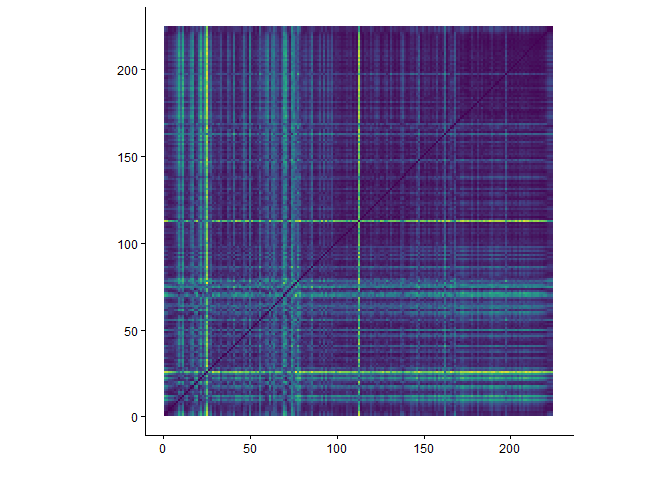
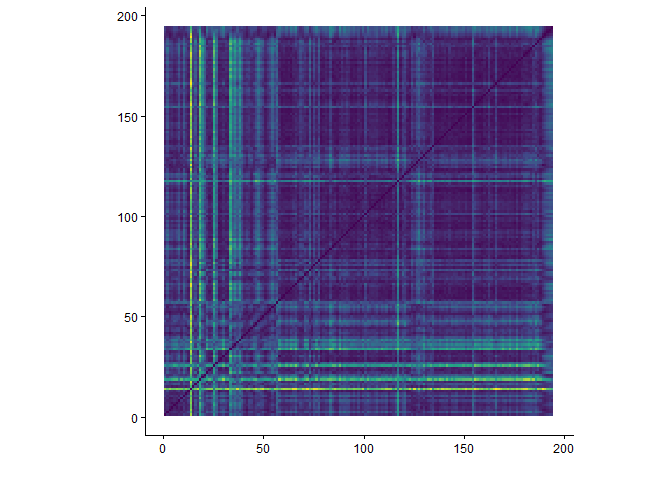

```{r imports}
library(plotly)
library(tidyverse)
library(compmus)
library(tidymodels)
library(ggdendro)
library(heatmaply)
```


---
title: "Dying Surfer Meets His Maker"
sidebar: dsmhm
format:
  html:
    theme: quartz
---

```{r setup, include=FALSE}
knitr::opts_chunk$set(echo = FALSE)
```

## Introduction

Each album analysis page has the exact same layout, that is:<br>
- Album Information<br>
- Metadata<br>
- Clustering<br>
- Harmony<br>
- Tempo<br>
- Timbre<br>
- Structure<br>
- Conclusion<br><br>

### Album Information

Released by New West Records on 30-10-2015 <br>
Genres according to database MusicBrainz<br>
- Rock<br><br>
Producer: Andy Putnam and All Them Witches<br>
Songwriting credits:<br>
- Charles Michael Parks Jr. - Vocals, Bass guitar, Electric Guitar and Acoustic Guitar<br>
- Allan Van Cleave - Rhodes Piano, Violin and Synthesizer Bass<br>
- Ben McLeod - Electric Guitar, Slide Guitar, Acoustic Guitar and Synthesizer Bass<br>
- Robby Staebler - Drums<br>
<br>
Additional credits on Track 4:<br>
- Mickey Raphael - Harmonica<br>

### Metadata

This album features 9 tracks, with an average duration of 5 minutes and 3 seconds. The track list below shows the length of each track in minutes.

```{r}
alltracks <- read_csv("computational_musicology_alltracks.csv")

alltracks <- alltracks %>%
  rename(duration = `Duration (ms)`)

dsmhm_data <- "Dying Surfer Meets His Maker"

dsmhm_df <- alltracks %>%
  filter(`Album Name` == "Dying Surfer Meets His Maker") %>%
  mutate(
    duration_min = duration / 60000,
    duration_label = sprintf(
      "%d:%02d",
      duration %/% 60000,
      (duration %% 60000) %/% 1000
    )
  )

dsmhm_df <- dsmhm_df %>%
  mutate(`Track Name` = factor(`Track Name`, levels = `Track Name`))

ggplot(dsmhm_df, aes(x = duration_min, y = forcats::fct_rev(`Track Name`))) +
  geom_col(fill = "#EB2E84") +
  geom_text(aes(label = duration_label), hjust = -0.1, size = 3) +
  labs(
    title = "Duration per Track",
    x = "Duration (minutes)",
    y = "Track"
  ) +
  theme_minimal() +
  xlim(0, max(dsmhm_df$duration_min) * 1.1)
```

The average tempo of this album is 120bpm with a minimum of 70bpm and a maximum of 171bpm. The track list below shows the tempo of each track in bpm.

```{r}
alltracks %>%
  filter(`Album Name` == "Dying Surfer Meets His Maker") %>%
  group_by(`Album Name`) %>%
  mutate(`Track Name` = factor(`Track Name`, levels = rev(unique(`Track Name`)))) %>%
  ungroup() %>%
  ggplot(aes(x = `Track Name`, y = Tempo)) +
  geom_col(fill = "#EB2E84") +
  coord_flip() +
  labs(
    x = "Track",
    y = "Tempo (BPM)",
    title = "Tempo per Track"
  ) +
  theme_minimal()
```

## Clustering

To analyze six albums within the scope of this course, clustering is used to select two representative tracks per album for deeper analysis. A hierarchical clustering tree is shown below, based on the following variables: danceability, energy, key, loudness, mode, speechiness, acousticness, instrumentalness, liveness, valence, tempo, duration, and time signature. Popularity is excluded, as it does not reflect the audio characteristics of the tracks. From each of the two primary clusters, the most streamed track is selected.<br><br>
Although there are only two tracks in cluster one the resulting clusters reflect distinct musical characteristics. The tracks in cluster one are heavy-hitting tracks with high energy and mostly distorted sounds. Cluster two, on the other hand, consists mostly of mellow, bittersweet-sounding folk tracks, with calm vocals and clean/acoustic guitars. The most streamed track in cluster one is *Dirt Preachers* and the most streamed track in cluster two is *Open Passageways*.

```{r}
dsmhm_juice <-
  alltracks %>%
  filter(`Album Name` == "Dying Surfer Meets His Maker") %>%
  mutate(`Track Name` = str_trunc(`Track Name`, 36)) %>%
  recipe(
    `Track Name` ~
      Danceability +
      Energy +
      Loudness +
      Speechiness +
      Acousticness +
      Instrumentalness +
      Liveness +
      Valence +
      Tempo
  ) |>
  step_center(all_predictors()) |>
  step_scale(all_predictors()) |> 
  prep() |>
  juice() |>
  column_to_rownames("Track Name")

dsmhm_dist <- dist(dsmhm_juice, method = "euclidean")

dsmhm_dist |> 
  hclust(method = "complete") |> 
  dendro_data() |>
  ggdendrogram()
```

## Harmony

Chromagram - *Dirt Preachers*<br><br>
As seen in the plot below, this track starts out with a dominant A pitch. Around 35, 50, 85 and 100 seconds, the dominant A changes to a dominant Bb, which is caused by a part of the chorus in which the Bb parts is played for an extended amount of time. After approximately 110 seconds, the track has a change of feel, along with different chord timing. The switching between chords becomes less frequent, resulting in wider stripes in the chromagram.

```{r}
dirt <- read_csv("dat/dirt.csv")

dirt |>
  compmus_wrangle_chroma() |> 
  mutate(pitches = map(pitches, compmus_normalise, "euclidean")) |>
  compmus_gather_chroma() |> 
  ggplot(
    aes(
      x = start + duration / 2,
      width = duration,
      y = pitch_class,
      fill = value
    )
  ) +
  geom_tile() +
  labs(x = "Time (s)", y = NULL, fill = "Magnitude") +
  theme_minimal() +
  scale_fill_viridis_c()
```

Chromagram - *Open Passageways*<br><br>
As seen in the plot below, this track has a dominant A pitch, along with its fifth, the E. There is little noise in the plot, as there is mostly acoustic instruments playing, with little effects involved. The first ten seconds are especially noiseless, as the drums are added in after the first ten seconds.

```{r}
passageways <- read_csv("dat/passageways.csv")

passageways |>
  compmus_wrangle_chroma() |> 
  mutate(pitches = map(pitches, compmus_normalise, "euclidean")) |>
  compmus_gather_chroma() |> 
  ggplot(
    aes(
      x = start + duration / 2,
      width = duration,
      y = pitch_class,
      fill = value
    )
  ) +
  geom_tile() +
  labs(x = "Time (s)", y = NULL, fill = "Magnitude") +
  theme_minimal() +
  scale_fill_viridis_c()
```


```{r}
circshift <- function(v, n) {
  if (n == 0) v else c(tail(v, n), head(v, -n))
}

#      C     C#    D     Eb    E     F     F#    G     Ab    A     Bb    B
major_chord <-
  c(   1,    0,    0,    0,    1,    0,    0,    1,    0,    0,    0,    0)
minor_chord <-
  c(   1,    0,    0,    1,    0,    0,    0,    1,    0,    0,    0,    0)
seventh_chord <-
  c(   1,    0,    0,    0,    1,    0,    0,    1,    0,    0,    1,    0)

major_key <-
  c(6.35, 2.23, 3.48, 2.33, 4.38, 4.09, 2.52, 5.19, 2.39, 3.66, 2.29, 2.88)
minor_key <-
  c(6.33, 2.68, 3.52, 5.38, 2.60, 3.53, 2.54, 4.75, 3.98, 2.69, 3.34, 3.17)

chord_templates <-
  tribble(
    ~name, ~template,
    "Gb:7", circshift(seventh_chord, 6),
    "Gb:maj", circshift(major_chord, 6),
    "Bb:min", circshift(minor_chord, 10),
    "Db:maj", circshift(major_chord, 1),
    "F:min", circshift(minor_chord, 5),
    "Ab:7", circshift(seventh_chord, 8),
    "Ab:maj", circshift(major_chord, 8),
    "C:min", circshift(minor_chord, 0),
    "Eb:7", circshift(seventh_chord, 3),
    "Eb:maj", circshift(major_chord, 3),
    "G:min", circshift(minor_chord, 7),
    "Bb:7", circshift(seventh_chord, 10),
    "Bb:maj", circshift(major_chord, 10),
    "D:min", circshift(minor_chord, 2),
    "F:7", circshift(seventh_chord, 5),
    "F:maj", circshift(major_chord, 5),
    "A:min", circshift(minor_chord, 9),
    "C:7", circshift(seventh_chord, 0),
    "C:maj", circshift(major_chord, 0),
    "E:min", circshift(minor_chord, 4),
    "G:7", circshift(seventh_chord, 7),
    "G:maj", circshift(major_chord, 7),
    "B:min", circshift(minor_chord, 11),
    "D:7", circshift(seventh_chord, 2),
    "D:maj", circshift(major_chord, 2),
    "F#:min", circshift(minor_chord, 6),
    "A:7", circshift(seventh_chord, 9),
    "A:maj", circshift(major_chord, 9),
    "C#:min", circshift(minor_chord, 1),
    "E:7", circshift(seventh_chord, 4),
    "E:maj", circshift(major_chord, 4),
    "G#:min", circshift(minor_chord, 8),
    "B:7", circshift(seventh_chord, 11),
    "B:maj", circshift(major_chord, 11),
    "D#:min", circshift(minor_chord, 3)
  )

key_templates <-
  tribble(
    ~name, ~template,
    "Gb:maj", circshift(major_key, 6),
    "Bb:min", circshift(minor_key, 10),
    "Db:maj", circshift(major_key, 1),
    "F:min", circshift(minor_key, 5),
    "Ab:maj", circshift(major_key, 8),
    "C:min", circshift(minor_key, 0),
    "Eb:maj", circshift(major_key, 3),
    "G:min", circshift(minor_key, 7),
    "Bb:maj", circshift(major_key, 10),
    "D:min", circshift(minor_key, 2),
    "F:maj", circshift(major_key, 5),
    "A:min", circshift(minor_key, 9),
    "C:maj", circshift(major_key, 0),
    "E:min", circshift(minor_key, 4),
    "G:maj", circshift(major_key, 7),
    "B:min", circshift(minor_key, 11),
    "D:maj", circshift(major_key, 2),
    "F#:min", circshift(minor_key, 6),
    "A:maj", circshift(major_key, 9),
    "C#:min", circshift(minor_key, 1),
    "E:maj", circshift(major_key, 4),
    "G#:min", circshift(minor_key, 8),
    "B:maj", circshift(major_key, 11),
    "D#:min", circshift(minor_key, 3)
  )
```

Keygram - *Dirt Preachers*<br><br>
As mentioned earlier, the most dominant pitch of this track up to the change of feel and timing is the A. In the keygram below, there is a clear difference between the first half and second half of the track, though the Amaj key seems to be the most evident throughout the song.

```{r}
dirt |> 
  compmus_wrangle_chroma() |> 
  filter(row_number() %% 50L == 0L) |> 
  compmus_match_pitch_template(
    key_templates,         # Change to chord_templates if desired
    method = "euclidean",  # Try different distance metrics
    norm = "manhattan"     # Try different norms
  ) |>
  ggplot(
    aes(x = start + duration / 2, width = 50 * duration, y = name, fill = d)
  ) +
  geom_tile() +
  scale_fill_viridis_c(guide = "none") +
  theme_minimal() +
  labs(x = "Time (s)", y = "")
```

Keygram - *Open Passageways*<br><br>
As mentioned earlier, the most dominant pitch of this track is the A, along with its fifth, the E. This keygram shows blue stripes through the Amaj and Amin, with the minor tonality a bit more evident.

```{r}
passageways |> 
  compmus_wrangle_chroma() |> 
  filter(row_number() %% 50L == 0L) |> 
  compmus_match_pitch_template(
    key_templates,         # Change to chord_templates if desired
    method = "euclidean",  # Try different distance metrics
    norm = "manhattan"     # Try different norms
  ) |>
  ggplot(
    aes(x = start + duration / 2, width = 50 * duration, y = name, fill = d)
  ) +
  geom_tile() +
  scale_fill_viridis_c(guide = "none") +
  theme_minimal() +
  labs(x = "Time (s)", y = "")
```

## Tempo

Tempogram - *Dirt Preachers*<br><br>
The tempogram below shows that the high energy parts of this track are too hard to be tracked, but it is evident that the tempo slows down throughout the whole track, making it probable that there was no fixed click track used at the recording of this track.

```{r}
dirttempo <- read_csv("dat/dirttempo.csv")

dirttempo |> 
  pivot_longer(-TIME, names_to = "tempo") |> 
  mutate(tempo = as.numeric(tempo)) |> 
  ggplot(aes(x = TIME, y = tempo, fill = value)) +
  geom_raster() +
  scale_y_continuous(transform = c("reciprocal", "reverse"), breaks = seq(50, 350, 100)) +    
  scale_fill_viridis_c(guide = "none") +
  labs(x = "Time (s)", y = "Tempo (BPM)") +
  theme_classic()
```

Tempogram - *Open Passageways*<br><br>
The tempogram below shows that only the intro of this track was able to be tracked. This is probably caused by the violin that is added from 55 seconds and onwards, making it harder to find the energy differences made by the rest of the other instruments.
```{r}
passagewaystempo <- read_csv("dat/passagewaystempo.csv")

passagewaystempo |> 
  pivot_longer(-TIME, names_to = "tempo") |> 
  mutate(tempo = as.numeric(tempo)) |> 
  ggplot(aes(x = TIME, y = tempo, fill = value)) +
  geom_raster() +
  scale_y_continuous(transform = c("reciprocal", "reverse"), breaks = seq(50, 350, 100)) +    
  scale_fill_viridis_c(guide = "none") +
  labs(x = "Time (s)", y = "Tempo (BPM)") +
  theme_classic()
```

## Timbre

Cepstogram - *Dirt Preachers*<br><br>
The Cepstogram below shows that this track evolves in a way. The yellow stripe gets brighter and brighter, which is caused by the use of more distorted guitar sounds near the end of the track, after the slow and clean part between 110 and 170 seconds.

```{r}
dirtmel <- read_csv("dat/dirtmel.csv")

dirtmel |>
  compmus_wrangle_timbre() |> 
  mutate(timbre = map(timbre, compmus_normalise, "euclidean")) |>
  compmus_gather_timbre() |>
  ggplot(
    aes(
      x = start + duration / 2,
      width = duration,
      y = mfcc,
      fill = value
    )
  ) +
  geom_tile() +
  labs(x = "Time (s)", y = NULL, fill = "Magnitude") +
  scale_fill_viridis_c() +                              
  theme_classic()
```

Cepstogram - *Open Passageways*<br><br>
The Cepstogram below shows that this is a really consistent track when speaking about timbre features, apart from the silence in the outro of the track.

```{r}
passagewaysmel <- read_csv("dat/passagewaysmel.csv")

passagewaysmel |>
  compmus_wrangle_timbre() |> 
  mutate(timbre = map(timbre, compmus_normalise, "euclidean")) |>
  compmus_gather_timbre() |>
  ggplot(
    aes(
      x = start + duration / 2,
      width = duration,
      y = mfcc,
      fill = value
    )
  ) +
  geom_tile() +
  labs(x = "Time (s)", y = NULL, fill = "Magnitude") +
  scale_fill_viridis_c() +                              
  theme_classic()
```

## Structure

Self-Similarity Matrix - *Dirt Preachers*<br><br>
This matrix shows that this track has a long repetitive second half, which consists of a long guitar solo. The green cross at 25 seconds is the first chorus, the green cross at 80 seconds is the second chorus and the bright cross at 110 is a short silence before the beginning of a verse.


```{r, eval=FALSE}
dirtmel |>
  compmus_wrangle_timbre() |> 
  filter(row_number() %% 50L == 0L) |> 
  mutate(timbre = map(timbre, compmus_normalise, "euclidean")) |>
  compmus_self_similarity(timbre, "cosine") |> 
  ggplot(
    aes(
      x = xstart + xduration / 2,
      width = 50 * xduration,
      y = ystart + yduration / 2,
      height = 50 * yduration,
      fill = d
    )
  ) +
  geom_tile() +
  coord_fixed() +
  scale_fill_viridis_c(guide = "none") +
  theme_classic() +
  labs(x = "", y = "")
```

Self-Similarity Matrix - *Open Passageways*<br><br>
This track is really repetitive, making the most subtle variations bright green in this matrix. The narrow bright green crosses are guitar fills. The vague green bars are the pre-choruses, with one at around 40 until 50 seconds and one at around 130 until 140 seconds.


```{r, eval=FALSE}
passagewaysmel |>
  compmus_wrangle_timbre() |> 
  filter(row_number() %% 50L == 0L) |> 
  mutate(timbre = map(timbre, compmus_normalise, "euclidean")) |>
  compmus_self_similarity(timbre, "cosine") |> 
  ggplot(
    aes(
      x = xstart + xduration / 2,
      width = 50 * xduration,
      y = ystart + yduration / 2,
      height = 50 * yduration,
      fill = d
    )
  ) +
  geom_tile() +
  coord_fixed() +
  scale_fill_viridis_c(guide = "none") +
  theme_classic() +
  labs(x = "", y = "")
```

## Conlusion - *Dying Surfer Meets His Maker*

Overall, this album provides a clear distinction between high energy, distorted tracks and soft acoustic folk tracks. The hierarchical clustering seperates these groups.<br><br>
Both representative tracks are centered around the pitch A, but both very differently. *Dirt Preachers* shifts and changes a lot, while *Open Passageways* stays harmonically stable, using the most of the A and its fifth, the E.<br><br>
Both tracks give significant reason to believe that there was no click track at the recording, making them feel organic and live.<br><br>
Both tracks are clearly organized. *Dirt Preachers* goes through an evolving structure, transitioning at the middle of the track, while *Open Passageways* uses repetition.<br><br>
Concluding, this album blends evolving high energy rock tracks with minimalistic folk tracks, resulting in a diverse yet coherent album.