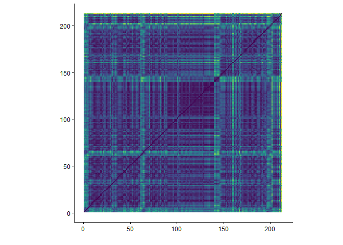
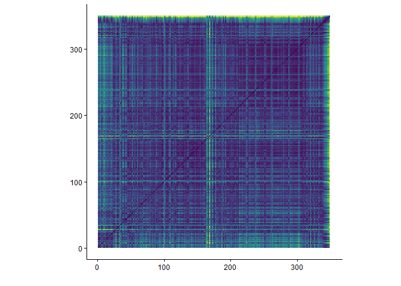

```{r imports}
library(plotly)
library(tidyverse)
library(compmus)
library(tidymodels)
library(ggdendro)
library(heatmaply)
```


---
title: "Lightning At The Door"
sidebar: latd
format:
  html:
    theme: quartz
---

```{r setup, include=FALSE}
knitr::opts_chunk$set(echo = FALSE)
```

## Introduction

Each album analysis page has the exact same layout, that is:<br>
- Album Information<br>
- Metadata<br>
- Clustering<br>
- Harmony<br>
- Tempo<br>
- Timbre<br>
- Structure<br>
- Conclusion<br><br>

### Album Information

Self-released on 5-11-2013<br>
Re-released by New West Records on 15-1-2016 <br>
Genres according to database MusicBrainz<br>
- Stoner rock
- Blues rock
- Psychedelic rock
- Rock<br><br>
Producer: Andy Putnam and All Them Witches<br>
Songwriting credits:<br>
- Charles Michael Parks Jr. - Vocals, Bass guitar and Acoustic Guitar<br>
- Allan Van Cleave - Keyboards, Rhodes Piano and Violin<br>
- Ben McLeod - Electric Guitar and Slide Guitar<br>
- Robby Staebler - Drums and Percussion<br>
<br>
Additional credits on Track 1 and 3:<br>
- Mickey Raphael - Harmonica<br>
- Jason Staebler - Electric Guitar<br>

### Metadata

This album features 10 tracks, with an average duration of 5 minutes and 34 seconds. The track list below shows the length of each track in minutes.


```{r}
alltracks <- read_csv("computational_musicology_alltracks.csv")

alltracks <- alltracks %>%
  rename(duration = `Duration (ms)`)

latd_data <- "Lightning At The Door"

latd_df <- alltracks %>%
  filter(`Album Name` == "Lightning At The Door") %>%
  mutate(
    duration_min = duration / 60000,
    duration_label = sprintf(
      "%d:%02d",
      duration %/% 60000,
      (duration %% 60000) %/% 1000
    )
  )

latd_df <- latd_df %>%
  mutate(`Track Name` = factor(`Track Name`, levels = `Track Name`))

ggplot(latd_df, aes(x = duration_min, y = forcats::fct_rev(`Track Name`))) +
  geom_col(fill = "#EB2E84") +
  geom_text(aes(label = duration_label), hjust = -0.1, size = 3) +
  labs(
    title = "Duration per Track",
    x = "Duration (minutes)",
    y = "Track"
  ) +
  theme_minimal() +
  xlim(0, max(latd_df$duration_min) * 1.1)
```

The average tempo of this album is 135bpm with a minimum of 88bpm and a maximum of 167bpm. The track list below shows the tempo of each track in bpm.

```{r}
alltracks %>%
  filter(`Album Name` == "Lightning At The Door") %>%
  group_by(`Album Name`) %>%
  mutate(`Track Name` = factor(`Track Name`, levels = rev(unique(`Track Name`)))) %>%
  ungroup() %>%
  ggplot(aes(x = `Track Name`, y = Tempo)) +
  geom_col(fill = "#EB2E84") +
  coord_flip() +
  labs(
    x = "Track",
    y = "Tempo (BPM)",
    title = "Tempo per Track"
  ) +
  theme_minimal()
```

## Clustering

To analyze six albums within the scope of this course, clustering is used to select two representative tracks per album for deeper analysis. A hierarchical clustering tree is shown below, based on the following variables: danceability, energy, key, loudness, mode, speechiness, acousticness, instrumentalness, liveness, valence, tempo, duration, and time signature. Popularity is excluded, as it does not reflect the audio characteristics of the tracks. From each of the two primary clusters, the most streamed track is selected.<br><br>
The resulting clusters reflect distinct musical characteristics. The tracks in cluster one are mostly hypnotically repetitive and tracks, with consistent energy throughout the track and a clear pulse. Cluster two, on the other hand, consists mostly of groove-heavy tracks with little vocals and big energy and loudness differences between parts of the tracks. The most streamed track in cluster one is *When God Comes Back* and the most streamed track in cluster two is *The Marriage Of Coyote Woman*.

```{r}
latd_juice <-
  alltracks %>%
  filter(`Album Name` == "Lightning At The Door") %>%
  mutate(`Track Name` = str_trunc(`Track Name`, 36)) %>%
  recipe(
    `Track Name` ~
      Danceability +
      Energy +
      Loudness +
      Speechiness +
      Acousticness +
      Instrumentalness +
      Liveness +
      Valence +
      Tempo
  ) |>
  step_center(all_predictors()) |>
  step_scale(all_predictors()) |> 
  prep() |>
  juice() |>
  column_to_rownames("Track Name")

latd_dist <- dist(latd_juice, method = "euclidean")

latd_dist |> 
  hclust(method = "complete") |> 
  dendro_data() |>
  ggdendrogram()
```

## Harmony

Chromagram - *When God Comes Back*<br><br>
As seen in the plot below, the most dominant pitches in this track are the C and G for the first half, but shift to the D and Bb, along with the C# and A, until almost the end of the track, as a result of a long bridge. 

```{r}
god <- read_csv("dat/god.csv")

god |>
  compmus_wrangle_chroma() |> 
  mutate(pitches = map(pitches, compmus_normalise, "euclidean")) |>
  compmus_gather_chroma() |> 
  ggplot(
    aes(
      x = start + duration / 2,
      width = duration,
      y = pitch_class,
      fill = value
    )
  ) +
  geom_tile() +
  labs(x = "Time (s)", y = NULL, fill = "Magnitude") +
  theme_minimal() +
  scale_fill_viridis_c()
```

Chromagram - *The Marriage Of Coyote Woman*<br><br>
As seen in the plot below, The most dominant pitches of this track are the A, F, C and most importantly D, as this pitch is the most lightly colored. This track seems to be quite repetitive, apart from the ending, which is the result of a silence of approximately ten seconds.
```{r}
marriage <- read_csv("dat/marriage.csv")

marriage |>
  compmus_wrangle_chroma() |> 
  mutate(pitches = map(pitches, compmus_normalise, "euclidean")) |>
  compmus_gather_chroma() |> 
  ggplot(
    aes(
      x = start + duration / 2,
      width = duration,
      y = pitch_class,
      fill = value
    )
  ) +
  geom_tile() +
  labs(x = "Time (s)", y = NULL, fill = "Magnitude") +
  theme_minimal() +
  scale_fill_viridis_c()
```

```{r}
circshift <- function(v, n) {
  if (n == 0) v else c(tail(v, n), head(v, -n))
}

#      C     C#    D     Eb    E     F     F#    G     Ab    A     Bb    B
major_chord <-
  c(   1,    0,    0,    0,    1,    0,    0,    1,    0,    0,    0,    0)
minor_chord <-
  c(   1,    0,    0,    1,    0,    0,    0,    1,    0,    0,    0,    0)
seventh_chord <-
  c(   1,    0,    0,    0,    1,    0,    0,    1,    0,    0,    1,    0)

major_key <-
  c(6.35, 2.23, 3.48, 2.33, 4.38, 4.09, 2.52, 5.19, 2.39, 3.66, 2.29, 2.88)
minor_key <-
  c(6.33, 2.68, 3.52, 5.38, 2.60, 3.53, 2.54, 4.75, 3.98, 2.69, 3.34, 3.17)

chord_templates <-
  tribble(
    ~name, ~template,
    "Gb:7", circshift(seventh_chord, 6),
    "Gb:maj", circshift(major_chord, 6),
    "Bb:min", circshift(minor_chord, 10),
    "Db:maj", circshift(major_chord, 1),
    "F:min", circshift(minor_chord, 5),
    "Ab:7", circshift(seventh_chord, 8),
    "Ab:maj", circshift(major_chord, 8),
    "C:min", circshift(minor_chord, 0),
    "Eb:7", circshift(seventh_chord, 3),
    "Eb:maj", circshift(major_chord, 3),
    "G:min", circshift(minor_chord, 7),
    "Bb:7", circshift(seventh_chord, 10),
    "Bb:maj", circshift(major_chord, 10),
    "D:min", circshift(minor_chord, 2),
    "F:7", circshift(seventh_chord, 5),
    "F:maj", circshift(major_chord, 5),
    "A:min", circshift(minor_chord, 9),
    "C:7", circshift(seventh_chord, 0),
    "C:maj", circshift(major_chord, 0),
    "E:min", circshift(minor_chord, 4),
    "G:7", circshift(seventh_chord, 7),
    "G:maj", circshift(major_chord, 7),
    "B:min", circshift(minor_chord, 11),
    "D:7", circshift(seventh_chord, 2),
    "D:maj", circshift(major_chord, 2),
    "F#:min", circshift(minor_chord, 6),
    "A:7", circshift(seventh_chord, 9),
    "A:maj", circshift(major_chord, 9),
    "C#:min", circshift(minor_chord, 1),
    "E:7", circshift(seventh_chord, 4),
    "E:maj", circshift(major_chord, 4),
    "G#:min", circshift(minor_chord, 8),
    "B:7", circshift(seventh_chord, 11),
    "B:maj", circshift(major_chord, 11),
    "D#:min", circshift(minor_chord, 3)
  )

key_templates <-
  tribble(
    ~name, ~template,
    "Gb:maj", circshift(major_key, 6),
    "Bb:min", circshift(minor_key, 10),
    "Db:maj", circshift(major_key, 1),
    "F:min", circshift(minor_key, 5),
    "Ab:maj", circshift(major_key, 8),
    "C:min", circshift(minor_key, 0),
    "Eb:maj", circshift(major_key, 3),
    "G:min", circshift(minor_key, 7),
    "Bb:maj", circshift(major_key, 10),
    "D:min", circshift(minor_key, 2),
    "F:maj", circshift(major_key, 5),
    "A:min", circshift(minor_key, 9),
    "C:maj", circshift(major_key, 0),
    "E:min", circshift(minor_key, 4),
    "G:maj", circshift(major_key, 7),
    "B:min", circshift(minor_key, 11),
    "D:maj", circshift(major_key, 2),
    "F#:min", circshift(minor_key, 6),
    "A:maj", circshift(major_key, 9),
    "C#:min", circshift(minor_key, 1),
    "E:maj", circshift(major_key, 4),
    "G#:min", circshift(minor_key, 8),
    "B:maj", circshift(major_key, 11),
    "D#:min", circshift(minor_key, 3)
  )
```

Keygram - *When God Comes Back*<br><br>
As mentioned earlier, the most dominant pitch of this track up to the bridge is the C, along with the G. There is no difference to be seen between the minor and major tonalities of the C. The bridge of the track is visible, with the Dmin slightly darker colored, and therefore, more prominent than other tonalities.

```{r}
god |> 
  compmus_wrangle_chroma() |> 
  filter(row_number() %% 50L == 0L) |> 
  compmus_match_pitch_template(
    key_templates,         # Change to chord_templates if desired
    method = "euclidean",  # Try different distance metrics
    norm = "manhattan"     # Try different norms
  ) |>
  ggplot(
    aes(x = start + duration / 2, width = 50 * duration, y = name, fill = d)
  ) +
  geom_tile() +
  scale_fill_viridis_c(guide = "none") +
  theme_minimal() +
  labs(x = "Time (s)", y = "")
```

Keygram - *The Marriage Of Coyote Woman*<br><br>
As mentioned earlier, the most dominant pitches of this track are A, F, C and most importantly D. This keygram shows no reason to believe this track is either written in Dmin or Dmaj. The thing that is evident, is that this track ends in a G, instead of a D,like you would expect.

```{r}
marriage |> 
  compmus_wrangle_chroma() |> 
  filter(row_number() %% 50L == 0L) |> 
  compmus_match_pitch_template(
    key_templates,         # Change to chord_templates if desired
    method = "euclidean",  # Try different distance metrics
    norm = "manhattan"     # Try different norms
  ) |>
  ggplot(
    aes(x = start + duration / 2, width = 50 * duration, y = name, fill = d)
  ) +
  geom_tile() +
  scale_fill_viridis_c(guide = "none") +
  theme_minimal() +
  labs(x = "Time (s)", y = "")
```


## Tempo

Tempogram - *When God Comes Back*<br><br>
The tempogram below shows that the tempo of the bridge of this track is hard to be tracked, but it is evident that it slows down, because the lines of the tempo subharmonics at the bridge are significantly lower than the tempo subharmonics at other parts of the track.

```{r}
godtempo <- read_csv("dat/godtempo.csv")

godtempo |> 
  pivot_longer(-TIME, names_to = "tempo") |> 
  mutate(tempo = as.numeric(tempo)) |> 
  ggplot(aes(x = TIME, y = tempo, fill = value)) +
  geom_raster() +
  scale_y_continuous(transform = c("reciprocal", "reverse"), breaks = seq(50, 350, 100)) +    
  scale_fill_viridis_c(guide = "none") +
  labs(x = "Time (s)", y = "Tempo (BPM)") +
  theme_classic()
```

Tempogram - *The Marriage Of Coyote Woman*<br><br>
The tempogram below shows that this track is fluctuating throughout the track, which probably means that there was no fixed click track at the recording of this track.

```{r}
marriagetempo <- read_csv("dat/marriagetempo.csv")

marriagetempo |> 
  pivot_longer(-TIME, names_to = "tempo") |> 
  mutate(tempo = as.numeric(tempo)) |> 
  ggplot(aes(x = TIME, y = tempo, fill = value)) +
  geom_raster() +
  scale_y_continuous(transform = c("reciprocal", "reverse"), breaks = seq(50, 350, 100)) +    
  scale_fill_viridis_c(guide = "none") +
  labs(x = "Time (s)", y = "Tempo (BPM)") +
  theme_classic()
```

## Timbre

Cepstogram - *When God Comes Back*<br><br>
The Cepstogram below shows spikes at 0, 30, 60 and 200, which are caused by a sudden mute of all instruments with only vocals playing. The bridge is also visible as an extra bright yellow bar from 90 seconds until 125 seconds, where it gets quiet, making a vertical stripe, until 150 seconds.

```{r}
godmel <- read_csv("dat/godmel.csv")

godmel |>
  compmus_wrangle_timbre() |> 
  mutate(timbre = map(timbre, compmus_normalise, "euclidean")) |>
  compmus_gather_timbre() |>
  ggplot(
    aes(
      x = start + duration / 2,
      width = duration,
      y = mfcc,
      fill = value
    )
  ) +
  geom_tile() +
  labs(x = "Time (s)", y = NULL, fill = "Magnitude") +
  scale_fill_viridis_c() +                              
  theme_classic()
```

Cepstogram - *The Marriage Of Coyote Woman*<br><br>
The Cepstogram below shows that this track is really consistent when speaking of timbre, apart from the almost silent intro and outro.

```{r}
marriagemel <- read_csv("dat/marriagemel.csv")

marriagemel |>
  compmus_wrangle_timbre() |> 
  mutate(timbre = map(timbre, compmus_normalise, "euclidean")) |>
  compmus_gather_timbre() |>
  ggplot(
    aes(
      x = start + duration / 2,
      width = duration,
      y = mfcc,
      fill = value
    )
  ) +
  geom_tile() +
  labs(x = "Time (s)", y = NULL, fill = "Magnitude") +
  scale_fill_viridis_c() +                              
  theme_classic()
```

## Structure

Self-Similarity Matrix - *When God Comes Back*<br><br>
This matrix provides a really clear structure, with green crosses at the parts where the instruments are silent and only vocals can be heard. The big blue block in the middle is caused by the repetitive instrumental bridge section.


```{r, eval=FALSE}
godmel |>
  compmus_wrangle_timbre() |> 
  filter(row_number() %% 50L == 0L) |> 
  mutate(timbre = map(timbre, compmus_normalise, "euclidean")) |>
  compmus_self_similarity(timbre, "cosine") |> 
  ggplot(
    aes(
      x = xstart + xduration / 2,
      width = 50 * xduration,
      y = ystart + yduration / 2,
      height = 50 * yduration,
      fill = d
    )
  ) +
  geom_tile() +
  coord_fixed() +
  scale_fill_viridis_c(guide = "none") +
  theme_classic() +
  labs(x = "", y = "")
```

Self-Similarity Matrix - *The Marriage Of Coyote Woman*<br><br>
This matrix show a green cross right through the middle of the track, which is caused by a guitar solo section. The outro is silent, which results in the grrn stripe at the top and right.


```{r, eval=FALSE}
marriagemel |>
  compmus_wrangle_timbre() |> 
  filter(row_number() %% 50L == 0L) |> 
  mutate(timbre = map(timbre, compmus_normalise, "euclidean")) |>
  compmus_self_similarity(timbre, "cosine") |> 
  ggplot(
    aes(
      x = xstart + xduration / 2,
      width = 50 * xduration,
      y = ystart + yduration / 2,
      height = 50 * yduration,
      fill = d
    )
  ) +
  geom_tile() +
  coord_fixed() +
  scale_fill_viridis_c(guide = "none") +
  theme_classic() +
  labs(x = "", y = "")
```

## Conlusion - *Lightning At The Door*

Overall, this is a cohesive, groove-oriented album. The hierarchical clustering shows two primary track groups: The first contains tracks with hypnotic repetitive structures with a clear pulse, and the other contains mostly instrumental, groove-heavy tracks with big shifts in energy, resulting in a rhythmic album containing tracks using musical evolution over vocal-driven styles.<br><br>
The tempo is stable, but organic. No extreme fluctuations, no fixed click track. Only subtle expressive changes<br><br>
Sections are clearly organized, though in different ways. *When God Comes Back* is clearly structured, breaking up the repetition with a bridge where you would expect it. *The Marriage Of Coyote Woman* on the other hand, is less segmented, more repetition-based, with the use of a solo section to break it up.<br><br>
Concluding, this album prioritizes groove and repetition, with some deviations that provide contrast. Subtle variation is the key in the atmospheric sound.
