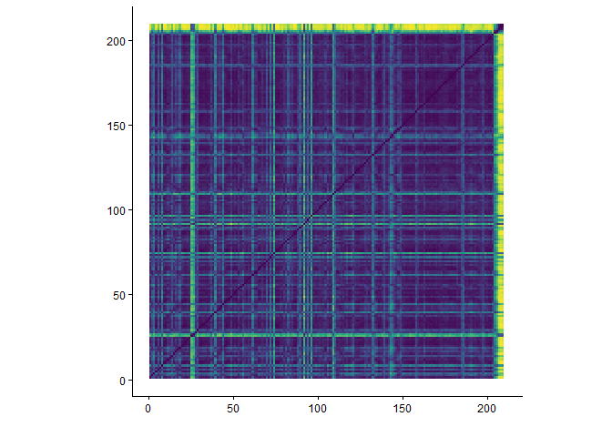
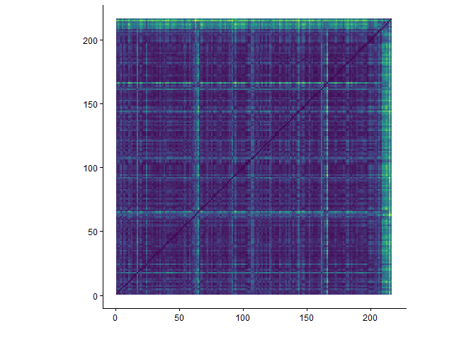

```{r imports}
library(plotly)
library(tidyverse)
library(compmus)
library(tidymodels)
library(ggdendro)
library(heatmaply)
```

---
title: "Nothing as the Ideal"
sidebar: nati
format:
  html:
    theme: quartz
---

```{r setup, include=FALSE}
knitr::opts_chunk$set(echo = FALSE)
```

## Introduction

Each album analysis page has the exact same layout, that is:<br>
- Album Information<br>
- Metadata<br>
- Clustering<br>
- Harmony<br>
- Tempo<br>
- Timbre<br>
- Structure<br>
- Conclusion<br><br>

### Album Information


Released by New West Records on 4-9-2020 <br>
Genres according to database MusicBrainz<br>
- Rock
- Stoner rock<br><br>
Producer: Andy Putnam and All Them Witches<br>
Songwriting credits:<br>
- Charles Michael Parks Jr. - Vocals, Bass guitar, Guitar, Loops and Piano<br>
- Ben McLeod - Electric Guitar, Resonator Guitar, Loops and Piano<br>
- Robby Staebler - Drums, Synthesizer, Loops and Tapes<br>
<br>

### Metadata

This album features 8 tracks, with an average duration of 5 minutes and 26 seconds. The track list below shows the length of each track in minutes.

```{r}
alltracks <- read_csv("computational_musicology_alltracks.csv")

alltracks <- alltracks %>%
  rename(duration = `Duration (ms)`)

nati_data <- "Nothing as the Ideal"

nati_df <- alltracks %>%
  filter(`Album Name` == "Nothing as the Ideal") %>%
  mutate(
    duration_min = duration / 60000,
    duration_label = sprintf(
      "%d:%02d",
      duration %/% 60000,
      (duration %% 60000) %/% 1000
    )
  )

nati_df <- nati_df %>%
  mutate(`Track Name` = factor(`Track Name`, levels = `Track Name`))

ggplot(nati_df, aes(x = duration_min, y = forcats::fct_rev(`Track Name`))) +
  geom_col(fill = "#EB2E84") +
  geom_text(aes(label = duration_label), hjust = -0.1, size = 3) +
  labs(
    title = "Duration per Track",
    x = "Duration (minutes)",
    y = "Track"
  ) +
  theme_minimal() +
  xlim(0, max(nati_df$duration_min) * 1.1)
```

The average tempo of this album is 111bpm with a minimum of 76bpm and a maximum of 152bpm. The track list below shows the tempo of each track in bpm.

```{r}
alltracks %>%
  filter(`Album Name` == "Nothing as the Ideal") %>%
  group_by(`Album Name`) %>%
  mutate(`Track Name` = factor(`Track Name`, levels = rev(unique(`Track Name`)))) %>%
  ungroup() %>%
  ggplot(aes(x = `Track Name`, y = Tempo)) +
  geom_col(fill = "#EB2E84") +
  coord_flip() +
  labs(
    x = "Track",
    y = "Tempo (BPM)",
    title = "Tempo per Track"
  ) +
  theme_minimal()
```

## Clustering

To analyze six albums within the scope of this course, clustering is used to select two representative tracks per album for deeper analysis. A hierarchical clustering tree is shown below, based on the following variables: danceability, energy, key, loudness, mode, speechiness, acousticness, instrumentalness, liveness, valence, tempo, duration, and time signature. Popularity is excluded, as it does not reflect the audio characteristics of the tracks. From each of the two primary clusters, the most streamed track is selected.<br><br>
The resulting clusters reflect distinct musical characteristics. The tracks in cluster one are heavy, fuzz-driven tracks with low-tuned instruments and dark sounding atmospheres and vocals. Cluster two consists of calm tracks, with on one hand the track *Everest*, an atmospheric and emotional guitar solo, and on the other hand two tracks with folk-style storytelling accompanied by clean/acoustic guitars. The most streamed track in cluster one is *Enemy of My Enemy* and the most streamed track in cluster two is *The Children of Coyote Woman*.

```{r}
nati_juice <-
  alltracks %>%
  filter(`Album Name` == "Nothing as the Ideal") %>%
  mutate(`Track Name` = str_trunc(`Track Name`, 36)) %>%
  recipe(
    `Track Name` ~
      Danceability +
      Energy +
      Loudness +
      Speechiness +
      Acousticness +
      Instrumentalness +
      Liveness +
      Valence +
      Tempo
  ) |>
  step_center(all_predictors()) |>
  step_scale(all_predictors()) |> 
  prep() |>
  juice() |>
  column_to_rownames("Track Name")

nati_dist <- dist(nati_juice, method = "euclidean")

nati_dist |> 
  hclust(method = "complete") |> 
  dendro_data() |>
  ggdendrogram()
```
## Harmony

Chromagram - *Enemy of My Enemy*<br><br>
As seen in the plot below, the most dominant pitches of this track are the G and C. There are a lot of prominent pitches in this chromagram, which is caused by an almost chromatic guitar riff and heavy distortion. At around 50 seconds, the short chorus starts, which uses the F# and C# pitches. These pitches seem to only be used in the two choruses, with the second chorus at approximately 110 seconds. At around 140 seconds, there is a high energy outro riff including a guitar solo, which leads to more pitches being used, making the C less prominent.

```{r}
enemy <- read_csv("dat/enemy.csv")

enemy |>
  compmus_wrangle_chroma() |> 
  mutate(pitches = map(pitches, compmus_normalise, "euclidean")) |>
  compmus_gather_chroma() |> 
  ggplot(
    aes(
      x = start + duration / 2,
      width = duration,
      y = pitch_class,
      fill = value
    )
  ) +
  geom_tile() +
  labs(x = "Time (s)", y = NULL, fill = "Magnitude") +
  theme_minimal() +
  scale_fill_viridis_c()
```

Chromagram - *The Children of Coyote Woman*<br><br>
As seen in the plot below, the most dominant pitch of this track is the A, along with the E, more subtly. This dominance of the A pitch is caused by an acoustic guitar that is playing mostly the A in octaves. The gaps in the yellow A stripe are parts in the track where the guitar plays a fill, which is why the narrow bright G stripes fall exactly in the gap of the A pitch. The chorus introduces the F pitch around 90 seconds into the track. This is repeated multiple times from 150 seconds onwards. The outro of this track is a recording of rain, making the last couple of seconds messy.

```{r}
children <- read_csv("dat/children.csv")

children |>
  compmus_wrangle_chroma() |> 
  mutate(pitches = map(pitches, compmus_normalise, "euclidean")) |>
  compmus_gather_chroma() |> 
  ggplot(
    aes(
      x = start + duration / 2,
      width = duration,
      y = pitch_class,
      fill = value
    )
  ) +
  geom_tile() +
  labs(x = "Time (s)", y = NULL, fill = "Magnitude") +
  theme_minimal() +
  scale_fill_viridis_c()
```

```{r}
circshift <- function(v, n) {
  if (n == 0) v else c(tail(v, n), head(v, -n))
}

#      C     C#    D     Eb    E     F     F#    G     Ab    A     Bb    B
major_chord <-
  c(   1,    0,    0,    0,    1,    0,    0,    1,    0,    0,    0,    0)
minor_chord <-
  c(   1,    0,    0,    1,    0,    0,    0,    1,    0,    0,    0,    0)
seventh_chord <-
  c(   1,    0,    0,    0,    1,    0,    0,    1,    0,    0,    1,    0)

major_key <-
  c(6.35, 2.23, 3.48, 2.33, 4.38, 4.09, 2.52, 5.19, 2.39, 3.66, 2.29, 2.88)
minor_key <-
  c(6.33, 2.68, 3.52, 5.38, 2.60, 3.53, 2.54, 4.75, 3.98, 2.69, 3.34, 3.17)

chord_templates <-
  tribble(
    ~name, ~template,
    "Gb:7", circshift(seventh_chord, 6),
    "Gb:maj", circshift(major_chord, 6),
    "Bb:min", circshift(minor_chord, 10),
    "Db:maj", circshift(major_chord, 1),
    "F:min", circshift(minor_chord, 5),
    "Ab:7", circshift(seventh_chord, 8),
    "Ab:maj", circshift(major_chord, 8),
    "C:min", circshift(minor_chord, 0),
    "Eb:7", circshift(seventh_chord, 3),
    "Eb:maj", circshift(major_chord, 3),
    "G:min", circshift(minor_chord, 7),
    "Bb:7", circshift(seventh_chord, 10),
    "Bb:maj", circshift(major_chord, 10),
    "D:min", circshift(minor_chord, 2),
    "F:7", circshift(seventh_chord, 5),
    "F:maj", circshift(major_chord, 5),
    "A:min", circshift(minor_chord, 9),
    "C:7", circshift(seventh_chord, 0),
    "C:maj", circshift(major_chord, 0),
    "E:min", circshift(minor_chord, 4),
    "G:7", circshift(seventh_chord, 7),
    "G:maj", circshift(major_chord, 7),
    "B:min", circshift(minor_chord, 11),
    "D:7", circshift(seventh_chord, 2),
    "D:maj", circshift(major_chord, 2),
    "F#:min", circshift(minor_chord, 6),
    "A:7", circshift(seventh_chord, 9),
    "A:maj", circshift(major_chord, 9),
    "C#:min", circshift(minor_chord, 1),
    "E:7", circshift(seventh_chord, 4),
    "E:maj", circshift(major_chord, 4),
    "G#:min", circshift(minor_chord, 8),
    "B:7", circshift(seventh_chord, 11),
    "B:maj", circshift(major_chord, 11),
    "D#:min", circshift(minor_chord, 3)
  )

key_templates <-
  tribble(
    ~name, ~template,
    "Gb:maj", circshift(major_key, 6),
    "Bb:min", circshift(minor_key, 10),
    "Db:maj", circshift(major_key, 1),
    "F:min", circshift(minor_key, 5),
    "Ab:maj", circshift(major_key, 8),
    "C:min", circshift(minor_key, 0),
    "Eb:maj", circshift(major_key, 3),
    "G:min", circshift(minor_key, 7),
    "Bb:maj", circshift(major_key, 10),
    "D:min", circshift(minor_key, 2),
    "F:maj", circshift(major_key, 5),
    "A:min", circshift(minor_key, 9),
    "C:maj", circshift(major_key, 0),
    "E:min", circshift(minor_key, 4),
    "G:maj", circshift(major_key, 7),
    "B:min", circshift(minor_key, 11),
    "D:maj", circshift(major_key, 2),
    "F#:min", circshift(minor_key, 6),
    "A:maj", circshift(major_key, 9),
    "C#:min", circshift(minor_key, 1),
    "E:maj", circshift(major_key, 4),
    "G#:min", circshift(minor_key, 8),
    "B:maj", circshift(major_key, 11),
    "D#:min", circshift(minor_key, 3)
  )
```

Keygram - *Enemy of My Enemy*<br><br>
As mentioned earlier, the most dominant pitches of this track are the G and C, with variations in the two choruses and an outro solo that introduces pitches that are used less throughout the rest of the track. The keygram below emphasizes the prominent C, with no significant difference Major and Minor. During the outro solo, the Gmaj is the most prominent.

```{r}
enemy |> 
  compmus_wrangle_chroma() |> 
  filter(row_number() %% 50L == 0L) |> 
  compmus_match_pitch_template(
    key_templates,         # Change to chord_templates if desired
    method = "euclidean",  # Try different distance metrics
    norm = "manhattan"     # Try different norms
  ) |>
  ggplot(
    aes(x = start + duration / 2, width = 50 * duration, y = name, fill = d)
  ) +
  geom_tile() +
  scale_fill_viridis_c(guide = "none") +
  theme_minimal() +
  labs(x = "Time (s)", y = "")
```

Keygram - *The Children of Coyote Woman*<br><br>
As mentioned earlier, the most dominant pitch of this track is the A, and G when the A is not played. The Amaj and Amin keys are shown as blue stripes throughout the whole track, along with the Emaj, Dmaj and Dmin. There is no significant reason to conclude that this song is either in Amaj or Amin. The ending is a blue block, which is caused by the rain sounds in the outro of the track.

```{r}
children |> 
  compmus_wrangle_chroma() |> 
  filter(row_number() %% 50L == 0L) |> 
  compmus_match_pitch_template(
    key_templates,         # Change to chord_templates if desired
    method = "euclidean",  # Try different distance metrics
    norm = "manhattan"     # Try different norms
  ) |>
  ggplot(
    aes(x = start + duration / 2, width = 50 * duration, y = name, fill = d)
  ) +
  geom_tile() +
  scale_fill_viridis_c(guide = "none") +
  theme_minimal() +
  labs(x = "Time (s)", y = "")
```


## Tempo

Tempogram - *Enemy of My Enemy*<br><br>
The tempogram below shows a clear, slightly ascending tempo, until the outro solo starts playing at around 125 seconds in. From that point onwards, the drum plays a lot of fills and unusual patterns, making it hard to track the tempo.

```{r}
enemytempo <- read_csv("dat/enemytempo.csv")

enemytempo |> 
  pivot_longer(-TIME, names_to = "tempo") |> 
  mutate(tempo = as.numeric(tempo)) |> 
  ggplot(aes(x = TIME, y = tempo, fill = value)) +
  geom_raster() +
  scale_y_continuous(transform = c("reciprocal", "reverse"), breaks = seq(50, 350, 100)) +    
  scale_fill_viridis_c(guide = "none") +
  labs(x = "Time (s)", y = "Tempo (BPM)") +
  theme_classic()
```

Tempogram - *The Children of Coyote Woman*<br><br>
The tempogram below shows a straight line, apart from the intro, outro and the part in the middle, because there is only vocals, guitar and rain sounds, without a clear pulse being provided by drums.

```{r}
childrentempo <- read_csv("dat/childrentempo.csv")

childrentempo |> 
  pivot_longer(-TIME, names_to = "tempo") |> 
  mutate(tempo = as.numeric(tempo)) |> 
  ggplot(aes(x = TIME, y = tempo, fill = value)) +
  geom_raster() +
  scale_y_continuous(transform = c("reciprocal", "reverse"), breaks = seq(50, 350, 100)) +    
  scale_fill_viridis_c(guide = "none") +
  labs(x = "Time (s)", y = "Tempo (BPM)") +
  theme_classic()
```

## Timbre

Cepstogram - *Enemy of My Enemy*<br><br>
The Cepstogram below shows a blue dot at mfcc_03, which is a silence before the start of a newly introduced outro riff. The green bar at 60 until 70 seconds at mfcc_02 is caused by a short guitar solo. The other tiny green bars are the result of short fills or variations in riffs. The silence at the end of the outro causes the sudden change to dark blue at the end at mfcc_02.

```{r}
enemymel <- read_csv("dat/enemymel.csv")

enemymel |>
  compmus_wrangle_timbre() |> 
  mutate(timbre = map(timbre, compmus_normalise, "euclidean")) |>
  compmus_gather_timbre() |>
  ggplot(
    aes(
      x = start + duration / 2,
      width = duration,
      y = mfcc,
      fill = value
    )
  ) +
  geom_tile() +
  labs(x = "Time (s)", y = NULL, fill = "Magnitude") +
  scale_fill_viridis_c() +                              
  theme_classic()
```

Cepstogram - *The Children of Coyote Woman*<br><br>
The Cepstogram below shows that this track is really consistent, with only variations shown when the guitar plays a fill, mostly seen in mfcc_03, mfcc_04 and mfcc_05. The rain sounds at the ending of the outro cause the sudden change at the end.

```{r}
childrenmel <- read_csv("dat/childrenmel.csv")

childrenmel |>
  compmus_wrangle_timbre() |> 
  mutate(timbre = map(timbre, compmus_normalise, "euclidean")) |>
  compmus_gather_timbre() |>
  ggplot(
    aes(
      x = start + duration / 2,
      width = duration,
      y = mfcc,
      fill = value
    )
  ) +
  geom_tile() +
  labs(x = "Time (s)", y = NULL, fill = "Magnitude") +
  scale_fill_viridis_c() +                              
  theme_classic()
```

## Structure

Self-Similarity Matrix - *Enemy of My Enemy*<br><br>
The bright green cross in this matrix at 33 seconds is caused by a vocal line with a lot of effect. At the 45 second mark, the are a couple of green stripes, which mark the first chorus of the track. At around 70 seconds there is a green cross consisting of multiple lines, which is created by a short guitar solo. At around the 140 second mark, the green cross represents the start of a new riff leading into an outro section. The green stripe at the top and right is a silence in the outro.


```{r, eval=FALSE}
enemymel |>
  compmus_wrangle_timbre() |> 
  filter(row_number() %% 50L == 0L) |> 
  mutate(timbre = map(timbre, compmus_normalise, "euclidean")) |>
  compmus_self_similarity(timbre, "cosine") |> 
  ggplot(
    aes(
      x = xstart + xduration / 2,
      width = 50 * xduration,
      y = ystart + yduration / 2,
      height = 50 * yduration,
      fill = d
    )
  ) +
  geom_tile() +
  coord_fixed() +
  scale_fill_viridis_c(guide = "none") +
  theme_classic() +
  labs(x = "", y = "")
```

Self-Similarity Matrix - *The Children of Coyote Woman*<br><br>
In this matrix there are two clear green crosses at around the 65 and 165 second mark, which are caused by guitar fills. The big green stripe at the top and right are caused by rain sounds at the end of the outro.


```{r, eval=FALSE}
childrenmel |>
  compmus_wrangle_timbre() |> 
  filter(row_number() %% 50L == 0L) |> 
  mutate(timbre = map(timbre, compmus_normalise, "euclidean")) |>
  compmus_self_similarity(timbre, "cosine") |> 
  ggplot(
    aes(
      x = xstart + xduration / 2,
      width = 50 * xduration,
      y = ystart + yduration / 2,
      height = 50 * yduration,
      fill = d
    )
  ) +
  geom_tile() +
  coord_fixed() +
  scale_fill_viridis_c(guide = "none") +
  theme_classic() +
  labs(x = "", y = "")
```

## Conlusion - *Nothing as the Ideal*

Overall, this album shows a big contrast between aggressive, dark fuzz-driven tracks and calm folky tracks. The hierarchical clustering seperated these tracks.<br><br>
Both groups stay around their tonal centers, but they do it quite differently. The more aggressive and dark sounding tracks use almost chromatic scales reaching most pitches, while the folky tracks stay around the same groups of pitches.<br><br>
This album is mostly steady when speaking about tempo, though there are some minor fluctuations, making the performance seem live and organic.<br><br>
Structurally, there are tracks with conventional rock structures, and tracks that follow more repetitive structures using guitar fills to break up the parts.<br><br>
Concluding, this album uses the contrast between heavy and calm tracks to its best quality, using a dark atmospheric sound on all tracks to keep the it cohesive.