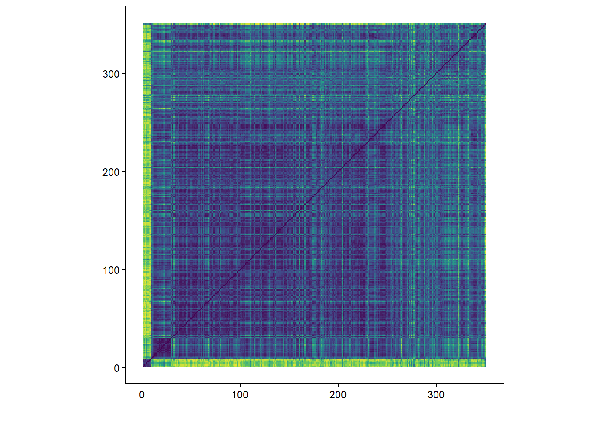
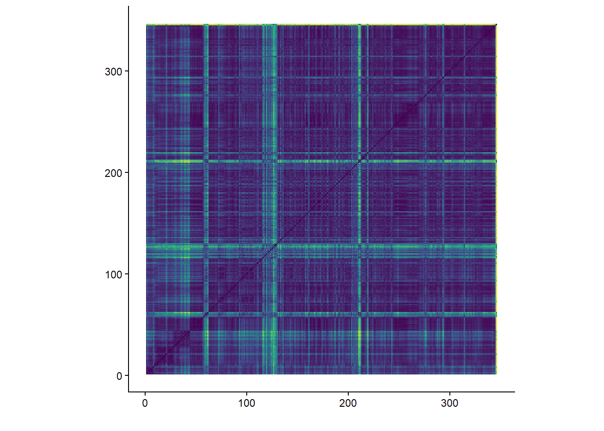

```{r imports}
library(plotly)
library(tidyverse)
library(compmus)
library(tidymodels)
library(ggdendro)
library(heatmaply)
```


---
title: "Our Mother Electricity"
sidebar: ome
format:
  html:
    theme: quartz
    code-fold: true
    fig-format: retina
---

```{r setup, include=FALSE}
knitr::opts_chunk$set(echo = FALSE)
```

## Introduction

Each album analysis page has the exact same layout, that is:<br>
- Album Information<br>
- Metadata<br>
- Clustering<br>
- Harmony<br>
- Tempo<br>
- Timbre<br>
- Structure<br>
- Conclusion<br><br>

### Album Information

Self-released on 16-9-2012<br>
Re-released by Elektrohasch Records on 7-12-2012 <br>
Genres according to database MusicBrainz<br>
- Stoner rock
- Blues rock
- Psychedelic
- Psychedelic rock
- Blues<br><br>
Producer: Andy Putnam<br>
Songwriting credits:<br>
- Charles Michael Parks Jr. - Vocals and Bass guitar<br>
- Allan Van Cleave - Keyboards<br>
- Ben McLeod - Vocals and Guitar<br>
- Robby Staebler - Drums and Percussion<br>

### Metadata

This album features 10 tracks, with an average duration of 4 minutes and 46 seconds. The track list below shows the length of each track in minutes.

```{r}
alltracks <- read_csv("computational_musicology_alltracks.csv")

alltracks <- alltracks %>%
  rename(duration = `Duration (ms)`)

alltracks <- alltracks %>%
  mutate(
    `Track Name` = recode(
      `Track Name`,
      "I Can't Even See Myself (Bonus)" = "I Can't Even See Myself"
    )
  )

ome_data <- "Our Mother Electricity"

ome_df <- alltracks %>%
  filter(`Album Name` == "Our Mother Electricity") %>%
  mutate(
    duration_min = duration / 60000,
    duration_label = sprintf(
      "%d:%02d",
      duration %/% 60000,
      (duration %% 60000) %/% 1000
    )
  )

ome_df <- ome_df %>%
  mutate(`Track Name` = factor(`Track Name`, levels = `Track Name`))

ggplot(ome_df, aes(x = duration_min, y = forcats::fct_rev(`Track Name`))) +
  geom_col(fill = "#EB2E84") +
  geom_text(aes(label = duration_label), hjust = -0.1, size = 3) +
  labs(
    title = "Duration per Track",
    x = "Duration (minutes)",
    y = "Track"
  ) +
  theme_minimal() +
  xlim(0, max(ome_df$duration_min) * 1.1)
```

The average tempo of this album is 124bpm with a minimum of 76bpm and a maximum of 174bpm. The track list below shows the tempo of each track in bpm.

```{r}
alltracks %>%
  filter(`Album Name` == "Our Mother Electricity") %>%
  group_by(`Album Name`) %>%
  mutate(`Track Name` = factor(`Track Name`, levels = rev(unique(`Track Name`)))) %>%
  ungroup() %>%
  ggplot(aes(x = `Track Name`, y = Tempo)) +
  geom_col(fill = "#EB2E84") +
  coord_flip() +
  labs(
    x = "Track",
    y = "Tempo (BPM)",
    title = "Tempo per Track"
  ) +
  theme_minimal()
```

## Clustering

To analyze six albums within the scope of this course, clustering is used to select two representative tracks per album for deeper analysis. A hierarchical clustering tree is shown below, based on the following variables: danceability, energy, key, loudness, mode, speechiness, acousticness, instrumentalness, liveness, valence, tempo, duration, and time signature. Popularity is excluded, as it does not reflect the audio characteristics of the tracks. From each of the two primary clusters, the most streamed track is selected.<br><br>
The resulting clusters reflect distinct musical characteristics. The tracks in cluster one are mellow tracks, containing mostly folky clean and/or acoustic guitars and calm vocals, with subtle percussion. Cluster two, on the other hand, consists mostly of higher energy rock tracks with a mix of clean and distorted sounds and more aggressive sounding vocals and percussion. The most streamed track in cluster one is *Elk.Blood.Heart* and the most streamed track in cluster two is *Heavy/Like a Witch*.

```{r}
ome_juice <-
  alltracks %>%
  filter(`Album Name` == "Our Mother Electricity") %>%
  mutate(`Track Name` = str_trunc(`Track Name`, 36)) %>%
  recipe(
    `Track Name` ~
      Danceability +
      Energy +
      Loudness +
      Speechiness +
      Acousticness +
      Instrumentalness +
      Liveness +
      Valence +
      Tempo
  ) |>
  step_center(all_predictors()) |>
  step_scale(all_predictors()) |> 
  prep() |>
  juice() |>
  column_to_rownames("Track Name")

ome_dist <- dist(ome_juice, method = "euclidean")

ome_dist |> 
  hclust(method = "complete") |> 
  dendro_data() |>
  ggdendrogram()
```
## Harmony

Chromagram - *Elk.Blood.Heart*<br><br>
As seen in the plot below, the most dominant pitch in this track is the D. The A, a fifth of D, is dominant together with D, as expected. The presence of the pitch F is interesting, as this makes the scenario in which the minor mode is used in this track quite probable, as opposed to the F#. At around the 300 seconds mark there is a shift to C# and back to D visible, which is the result of a minor change in the melody and chords of the chorus.

```{r}
elk <- read_csv("dat/Elkchroma.csv")

elk |>
  compmus_wrangle_chroma() |> 
  mutate(pitches = map(pitches, compmus_normalise, "euclidean")) |>
  compmus_gather_chroma() |> 
  ggplot(
    aes(
      x = start + duration / 2,
      width = duration,
      y = pitch_class,
      fill = value
    )
  ) +
  geom_tile() +
  labs(x = "Time (s)", y = NULL, fill = "Magnitude") +
  theme_minimal() +
  scale_fill_viridis_c()
```

Chromagram - *Heavy/Like a Witch*<br><br>
As seen in the plot below, the most dominant pitch in this track is the C, along with the Bb, G and most importantly E, which could suggest a major tonality. The start of the track seems messy, which is the result of a vocal part that sounds quite different compared to the rest of the track. The bright green C part at the last quarter of the track is caused by a chugging guitar riff that is mostly played on C.

```{r}
heavy <- read_csv("dat/heavy.csv")

heavy |>
  compmus_wrangle_chroma() |> 
  mutate(pitches = map(pitches, compmus_normalise, "euclidean")) |>
  compmus_gather_chroma() |> 
  ggplot(
    aes(
      x = start + duration / 2,
      width = duration,
      y = pitch_class,
      fill = value
    )
  ) +
  geom_tile() +
  labs(x = "Time (s)", y = NULL, fill = "Magnitude") +
  theme_minimal() +
  scale_fill_viridis_c()
```
Keygram - *Elk.Blood.Heart*<br><br>
As mentioned earlier, the most dominant pitch of this track is the D. The keygram below shows a blue bar at both the Dmaj and Dmin, though the Dmin seems more evident. The Gmaj and Gmin, the fifth of D, show a blue bar as well. The minor variations in the chorus are not visible in the keygram.

```{r}
circshift <- function(v, n) {
  if (n == 0) v else c(tail(v, n), head(v, -n))
}

#      C     C#    D     Eb    E     F     F#    G     Ab    A     Bb    B
major_chord <-
  c(   1,    0,    0,    0,    1,    0,    0,    1,    0,    0,    0,    0)
minor_chord <-
  c(   1,    0,    0,    1,    0,    0,    0,    1,    0,    0,    0,    0)
seventh_chord <-
  c(   1,    0,    0,    0,    1,    0,    0,    1,    0,    0,    1,    0)

major_key <-
  c(6.35, 2.23, 3.48, 2.33, 4.38, 4.09, 2.52, 5.19, 2.39, 3.66, 2.29, 2.88)
minor_key <-
  c(6.33, 2.68, 3.52, 5.38, 2.60, 3.53, 2.54, 4.75, 3.98, 2.69, 3.34, 3.17)

chord_templates <-
  tribble(
    ~name, ~template,
    "Gb:7", circshift(seventh_chord, 6),
    "Gb:maj", circshift(major_chord, 6),
    "Bb:min", circshift(minor_chord, 10),
    "Db:maj", circshift(major_chord, 1),
    "F:min", circshift(minor_chord, 5),
    "Ab:7", circshift(seventh_chord, 8),
    "Ab:maj", circshift(major_chord, 8),
    "C:min", circshift(minor_chord, 0),
    "Eb:7", circshift(seventh_chord, 3),
    "Eb:maj", circshift(major_chord, 3),
    "G:min", circshift(minor_chord, 7),
    "Bb:7", circshift(seventh_chord, 10),
    "Bb:maj", circshift(major_chord, 10),
    "D:min", circshift(minor_chord, 2),
    "F:7", circshift(seventh_chord, 5),
    "F:maj", circshift(major_chord, 5),
    "A:min", circshift(minor_chord, 9),
    "C:7", circshift(seventh_chord, 0),
    "C:maj", circshift(major_chord, 0),
    "E:min", circshift(minor_chord, 4),
    "G:7", circshift(seventh_chord, 7),
    "G:maj", circshift(major_chord, 7),
    "B:min", circshift(minor_chord, 11),
    "D:7", circshift(seventh_chord, 2),
    "D:maj", circshift(major_chord, 2),
    "F#:min", circshift(minor_chord, 6),
    "A:7", circshift(seventh_chord, 9),
    "A:maj", circshift(major_chord, 9),
    "C#:min", circshift(minor_chord, 1),
    "E:7", circshift(seventh_chord, 4),
    "E:maj", circshift(major_chord, 4),
    "G#:min", circshift(minor_chord, 8),
    "B:7", circshift(seventh_chord, 11),
    "B:maj", circshift(major_chord, 11),
    "D#:min", circshift(minor_chord, 3)
  )

key_templates <-
  tribble(
    ~name, ~template,
    "Gb:maj", circshift(major_key, 6),
    "Bb:min", circshift(minor_key, 10),
    "Db:maj", circshift(major_key, 1),
    "F:min", circshift(minor_key, 5),
    "Ab:maj", circshift(major_key, 8),
    "C:min", circshift(minor_key, 0),
    "Eb:maj", circshift(major_key, 3),
    "G:min", circshift(minor_key, 7),
    "Bb:maj", circshift(major_key, 10),
    "D:min", circshift(minor_key, 2),
    "F:maj", circshift(major_key, 5),
    "A:min", circshift(minor_key, 9),
    "C:maj", circshift(major_key, 0),
    "E:min", circshift(minor_key, 4),
    "G:maj", circshift(major_key, 7),
    "B:min", circshift(minor_key, 11),
    "D:maj", circshift(major_key, 2),
    "F#:min", circshift(minor_key, 6),
    "A:maj", circshift(major_key, 9),
    "C#:min", circshift(minor_key, 1),
    "E:maj", circshift(major_key, 4),
    "G#:min", circshift(minor_key, 8),
    "B:maj", circshift(major_key, 11),
    "D#:min", circshift(minor_key, 3)
  )
```
```{r}
elk |> 
  compmus_wrangle_chroma() |> 
  filter(row_number() %% 50L == 0L) |> 
  compmus_match_pitch_template(
    key_templates,         # Change to chord_templates if desired
    method = "euclidean",  # Try different distance metrics
    norm = "manhattan"     # Try different norms
  ) |>
  ggplot(
    aes(x = start + duration / 2, width = 50 * duration, y = name, fill = d)
  ) +
  geom_tile() +
  scale_fill_viridis_c(guide = "none") +
  theme_minimal() +
  labs(x = "Time (s)", y = "")
```

Keygram - *Heavy/Like a Witch*<br><br>
As mentioned earlier, the most dominant pitch of this track is the C. The keygram below shows a blue bar at both the Cmaj and Cmin, though the Cmaj seems more evident. The vertical gray stripe most likely resembles a silence, which is placed withing the solo vocal intro. The ending riff on C is clearly portrayed, showing bigger differences between the C tonalities and other tonalities as compared to the rest of the track.

```{r}
heavy |> 
  compmus_wrangle_chroma() |> 
  filter(row_number() %% 50L == 0L) |> 
  compmus_match_pitch_template(
    key_templates,         # Change to chord_templates if desired
    method = "euclidean",  # Try different distance metrics
    norm = "manhattan"     # Try different norms
  ) |>
  ggplot(
    aes(x = start + duration / 2, width = 50 * duration, y = name, fill = d)
  ) +
  geom_tile() +
  scale_fill_viridis_c(guide = "none") +
  theme_minimal() +
  labs(x = "Time (s)", y = "")
```
## Tempo

Tempogram - *Elk.Blood.Heart*<br><br>
The tempogram below shows that the higher energy parts and soft intro of this track are too hard to be tracked, but it is evident that there are tempo fluctuations which makes it probable that this track is recorded without a fixed click track.

```{r}
elktempo <- read_csv("dat/elktempo.csv")

elktempo |> 
  pivot_longer(-TIME, names_to = "tempo") |> 
  mutate(tempo = as.numeric(tempo)) |> 
  ggplot(aes(x = TIME, y = tempo, fill = value)) +
  geom_raster() +
  scale_y_continuous(transform = c("reciprocal", "reverse"), breaks = seq(50, 350, 100)) +    
  scale_fill_viridis_c(guide = "none") +
  labs(x = "Time (s)", y = "Tempo (BPM)") +
  theme_classic()
```

Tempogram - *Heavy/Like a Witch*<br><br>
The tempogram below shows that the parts of this track in which the drummer mostly plays fills are too hard to be tracked. There is no significant reason to believe that the tempo changes throughout the track.

```{r}
heavytempo <- read_csv("dat/heavytempo.csv")

heavytempo |> 
  pivot_longer(-TIME, names_to = "tempo") |> 
  mutate(tempo = as.numeric(tempo)) |> 
  ggplot(aes(x = TIME, y = tempo, fill = value)) +
  geom_raster() +
  scale_y_continuous(transform = c("reciprocal", "reverse"), breaks = seq(50, 350, 100)) +    
  scale_fill_viridis_c(guide = "none") +
  labs(x = "Time (s)", y = "Tempo (BPM)") +
  theme_classic()
```


## Timbre

Cepstogram - *Elk.Blood.Heart*<br><br>
The Cepstogram below shows that there is a change of timbre after the soft intro and from the solo at 240 seconds and onwards.

```{r}
elkmel <- read_csv("dat/elkmel.csv")
```

```{r}
elkmel |>
  compmus_wrangle_timbre() |> 
  mutate(timbre = map(timbre, compmus_normalise, "euclidean")) |>
  compmus_gather_timbre() |>
  ggplot(
    aes(
      x = start + duration / 2,
      width = duration,
      y = mfcc,
      fill = value
    )
  ) +
  geom_tile() +
  labs(x = "Time (s)", y = NULL, fill = "Magnitude") +
  scale_fill_viridis_c() +                              
  theme_classic()
```

Cepstogram - *Heavy/Like a Witch*<br><br>
The Cepstogram below shows that there is a change of timbre after the vocal intro and from the outro riff from 240 seconds and onwards, which is only played by guitar at first, resulting in the bright yellow line at mfcc_02.
```{r}
heavymel <- read_csv("dat/heavymel.csv")
```

```{r}
heavymel |>
  compmus_wrangle_timbre() |> 
  mutate(timbre = map(timbre, compmus_normalise, "euclidean")) |>
  compmus_gather_timbre() |>
  ggplot(
    aes(
      x = start + duration / 2,
      width = duration,
      y = mfcc,
      fill = value
    )
  ) +
  geom_tile() +
  labs(x = "Time (s)", y = NULL, fill = "Magnitude") +
  scale_fill_viridis_c() +                              
  theme_classic()
```

## Structure

Self-Similarity Matrix - *Elk.Blood.Heart*<br><br>
The most noticeable thing about this self-similarity matrix is the Green vertical and horizontal stripe at the bottom and left, caused by the soft intro. This makes it hard to interpret the rest of the matrix, though the start of the guitar solo at around 280 seconds is clear, with a big green cross, portraying the change in the track. 


```{r, eval=FALSE}
elkmel |>
  compmus_wrangle_timbre() |> 
  filter(row_number() %% 50L == 0L) |> 
  mutate(timbre = map(timbre, compmus_normalise, "euclidean")) |>
  compmus_self_similarity(timbre, "cosine") |> 
  ggplot(
    aes(
      x = xstart + xduration / 2,
      width = 50 * xduration,
      y = ystart + yduration / 2,
      height = 50 * yduration,
      fill = d
    )
  ) +
  geom_tile() +
  coord_fixed() +
  scale_fill_viridis_c(guide = "none") +
  theme_classic() +
  labs(x = "", y = "")
```

Self-Similarity Matrix - *Heavy/Like a Witch*<br><br>
This matrix provides a really clear structure, with a vague bar from 0 to 40 seconds where the vocal intro is playing, and bright green crosses at the pre-chorus and chorus at approximately 60, 120 and 210 seconds.


```{r, eval=FALSE}
heavymel |>
  compmus_wrangle_timbre() |> 
  filter(row_number() %% 50L == 0L) |> 
  mutate(timbre = map(timbre, compmus_normalise, "euclidean")) |>
  compmus_self_similarity(timbre, "cosine") |> 
  ggplot(
    aes(
      x = xstart + xduration / 2,
      width = 50 * xduration,
      y = ystart + yduration / 2,
      height = 50 * yduration,
      fill = d
    )
  ) +
  geom_tile() +
  coord_fixed() +
  scale_fill_viridis_c(guide = "none") +
  theme_classic() +
  labs(x = "", y = "")
```

## Conlusion - *Our Mother Electricity*

Overall, this album represents a contrast between mellow compositions and more aggressive, high-energy rock tracks. The hierarchical clustering tree supports this fact, seperating the album into these two groups.<br><br>
The album has an organic feel for tempo, without the use of a fixed click track, making the tracks feel more alive and expressive, especially in the more emotional tracks like *Elk.Blood.Heart*.<br><br>
Clear sectional changes are evident, but different between the two analyzed tracks. *Heavy/Like a Witch* has a well-defined and conventional structure while *Elk.Blood.Heart* seems more atmospheric.<br><br>
Concluding, this album provides an intentional contrast between mellowness and intensity, making the album diverse and yet a cohesive whole, strengthening eacother.


