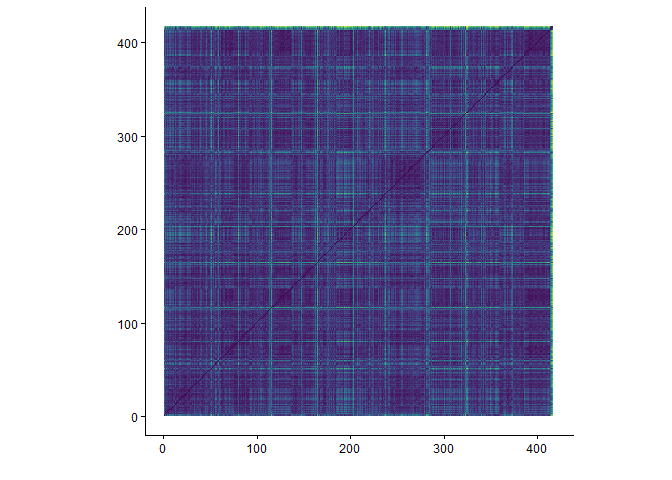
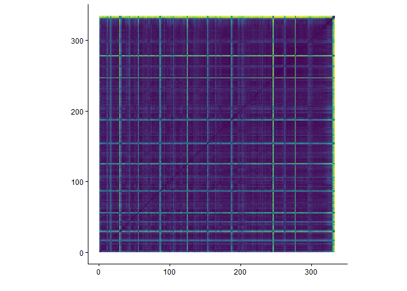

```{r imports}
library(plotly)
library(tidyverse)
library(compmus)
library(tidymodels)
library(ggdendro)
library(heatmaply)
```


---
title: "Sleeping Through The War"
sidebar: sttw
format:
  html:
    theme: quartz
---

```{r setup, include=FALSE}
knitr::opts_chunk$set(echo = FALSE)
```

## Introduction

Each album analysis page has the exact same layout, that is:<br>
- Album Information<br>
- Metadata<br>
- Clustering<br>
- Harmony<br>
- Tempo<br>
- Timbre<br>
- Structure<br>
- Conclusion<br><br>

### Album Information

Released by New West Records on 24-2-2017 <br>
Genres according to database MusicBrainz<br>
- Blues rock
- Psychedelic rock
- Hard rock
- Neo-psychedelica
- Rock<br><br>
Producer: Dave Cobb<br>
Songwriting credits:<br>
- Charles Michael Parks Jr. - Vocals, Bass guitar, Acoustic Guitar, Mellotron, Percussion and Loops<br>
- Allan Van Cleave - Organ, Piano, Rhodes Piano and Mellotron<br>
- Ben McLeod - Electric Guitar, Bass, Mellotron and Percussion<br>
- Robby Staebler - Drums and Congas<br>
<br>
Additional credits:<br>
- Mickey Raphael - Harmonica<br>
- Dave Cobb - Percussion<br>
- Caitlin Rose - Backing Vocals
- Erin Rae - Backing Vocals
- Tristan Gaspadarek - Backing Vocals

### Metadata

This album features 8 tracks, with an average duration of 5 minutes and 46 seconds. The track list below shows the length of each track in minutes.

```{r}
alltracks <- read_csv("computational_musicology_alltracks.csv")

alltracks <- alltracks %>%
  rename(duration = `Duration (ms)`)

alltracks <- alltracks %>%
  mutate(`Track Name` = as.character(`Track Name`))

sttw_data <- "Sleeping Through The War"

sttw_df <- alltracks %>%
  filter(`Album Name` == "Sleeping Through The War") %>%
  mutate(
    duration_min = duration / 60000,
    duration_label = sprintf(
      "%d:%02d",
      duration %/% 60000,
      (duration %% 60000) %/% 1000
    )
  )

sttw_df <- sttw_df %>%
  mutate(`Track Name` = factor(`Track Name`, levels = `Track Name`))

ggplot(sttw_df, aes(x = duration_min, y = forcats::fct_rev(`Track Name`))) +
  geom_col(fill = "#EB2E84") +
  geom_text(aes(label = duration_label), hjust = -0.1, size = 3) +
  labs(
    title = "Duration per Track",
    x = "Duration (minutes)",
    y = "Track"
  ) +
  theme_minimal() +
  xlim(0, max(sttw_df$duration_min) * 1.1)
```

The average tempo of this album is 117bpm with a minimum of 84bpm and a maximum of 139bpm. The track list below shows the tempo of each track in bpm.	

```{r}
alltracks %>%
  filter(`Album Name` == "Sleeping Through The War") %>%
  group_by(`Album Name`) %>%
  mutate(`Track Name` = factor(`Track Name`, levels = rev(unique(`Track Name`)))) %>%
  ungroup() %>%
  ggplot(aes(x = `Track Name`, y = Tempo)) +
  geom_col(fill = "#EB2E84") +
  coord_flip() +
  labs(
    x = "Track",
    y = "Tempo (BPM)",
    title = "Tempo per Track"
  ) +
  theme_minimal()
```

## Clustering

To analyze six albums within the scope of this course, clustering is used to select two representative tracks per album for deeper analysis. A hierarchical clustering tree is shown below, based on the following variables: danceability, energy, key, loudness, mode, speechiness, acousticness, instrumentalness, liveness, valence, tempo, duration, and time signature. Popularity is excluded, as it does not reflect the audio characteristics of the tracks. From each of the two primary clusters, the most streamed track is selected.<br><br>
The resulting clusters reflect distinct musical characteristics. The tracks in cluster one are mostly tracks that switch between fuzz-driven, high energy parts and clean and calm parts multiple times in the track. Cluster two, on the other hand, consists mostly of hypnotically repeating psychedelic grooves using instruments with heavy reverb and experimental effects, delay as the most notable one. The most streamed track in cluster one is *Alabaster* and the most streamed track in cluster two is *Am I Going Up?*.

```{r}
sttw_juice <-
  alltracks %>%
  mutate(`Track Name` = as.character(`Track Name`)) %>%
  filter(`Album Name` == "Sleeping Through The War") %>%
  mutate(`Track Name` = stringr::str_trunc(as.character(`Track Name`), 36)) %>%
  recipe(
    `Track Name` ~
      Danceability +
      Energy +
      Loudness +
      Speechiness +
      Acousticness +
      Instrumentalness +
      Liveness +
      Valence +
      Tempo
  ) |>
  step_center(all_predictors()) |>
  step_scale(all_predictors()) |> 
  prep() |>
  juice() |>
  column_to_rownames("Track Name")

rownames(sttw_juice) <- as.character(rownames(sttw_juice))

sttw_dist <- dist(sttw_juice, method = "euclidean")

d <- sttw_dist |> 
  hclust(method = "complete") |> 
  dendro_data()
d$labels$label <- as.character(d$labels$label)
ggdendrogram(d)
```

## Harmony

Chromagram - *Alabaster*<br><br>
As seen in the plot below, the dominant pitches, mostly Bb, E and C, are consistent until the halfway point of the track. After the halfway point, there is an instrumental section with added percussion and guitar fills, which make the chromagram a lot more busy. Apart from that, this track is consistent and repeats itself constantly.

```{r}
alabaster <- read_csv("dat/alabaster.csv")

alabaster |>
  compmus_wrangle_chroma() |> 
  mutate(pitches = map(pitches, compmus_normalise, "euclidean")) |>
  compmus_gather_chroma() |> 
  ggplot(
    aes(
      x = start + duration / 2,
      width = duration,
      y = pitch_class,
      fill = value
    )
  ) +
  geom_tile() +
  labs(x = "Time (s)", y = NULL, fill = "Magnitude") +
  theme_minimal() +
  scale_fill_viridis_c()
```

Chromagram - *Am I Going Up?*<br><br>
As seen in the plot below, the dominant pitches of this track are A and E. This track repeats itself over and over again, resulting in a really consistent chromagram.

```{r}
up <- read_csv("dat/up.csv")

up |>
  compmus_wrangle_chroma() |> 
  mutate(pitches = map(pitches, compmus_normalise, "euclidean")) |>
  compmus_gather_chroma() |> 
  ggplot(
    aes(
      x = start + duration / 2,
      width = duration,
      y = pitch_class,
      fill = value
    )
  ) +
  geom_tile() +
  labs(x = "Time (s)", y = NULL, fill = "Magnitude") +
  theme_minimal() +
  scale_fill_viridis_c()
```

```{r}
circshift <- function(v, n) {
  if (n == 0) v else c(tail(v, n), head(v, -n))
}

#      C     C#    D     Eb    E     F     F#    G     Ab    A     Bb    B
major_chord <-
  c(   1,    0,    0,    0,    1,    0,    0,    1,    0,    0,    0,    0)
minor_chord <-
  c(   1,    0,    0,    1,    0,    0,    0,    1,    0,    0,    0,    0)
seventh_chord <-
  c(   1,    0,    0,    0,    1,    0,    0,    1,    0,    0,    1,    0)

major_key <-
  c(6.35, 2.23, 3.48, 2.33, 4.38, 4.09, 2.52, 5.19, 2.39, 3.66, 2.29, 2.88)
minor_key <-
  c(6.33, 2.68, 3.52, 5.38, 2.60, 3.53, 2.54, 4.75, 3.98, 2.69, 3.34, 3.17)

chord_templates <-
  tribble(
    ~name, ~template,
    "Gb:7", circshift(seventh_chord, 6),
    "Gb:maj", circshift(major_chord, 6),
    "Bb:min", circshift(minor_chord, 10),
    "Db:maj", circshift(major_chord, 1),
    "F:min", circshift(minor_chord, 5),
    "Ab:7", circshift(seventh_chord, 8),
    "Ab:maj", circshift(major_chord, 8),
    "C:min", circshift(minor_chord, 0),
    "Eb:7", circshift(seventh_chord, 3),
    "Eb:maj", circshift(major_chord, 3),
    "G:min", circshift(minor_chord, 7),
    "Bb:7", circshift(seventh_chord, 10),
    "Bb:maj", circshift(major_chord, 10),
    "D:min", circshift(minor_chord, 2),
    "F:7", circshift(seventh_chord, 5),
    "F:maj", circshift(major_chord, 5),
    "A:min", circshift(minor_chord, 9),
    "C:7", circshift(seventh_chord, 0),
    "C:maj", circshift(major_chord, 0),
    "E:min", circshift(minor_chord, 4),
    "G:7", circshift(seventh_chord, 7),
    "G:maj", circshift(major_chord, 7),
    "B:min", circshift(minor_chord, 11),
    "D:7", circshift(seventh_chord, 2),
    "D:maj", circshift(major_chord, 2),
    "F#:min", circshift(minor_chord, 6),
    "A:7", circshift(seventh_chord, 9),
    "A:maj", circshift(major_chord, 9),
    "C#:min", circshift(minor_chord, 1),
    "E:7", circshift(seventh_chord, 4),
    "E:maj", circshift(major_chord, 4),
    "G#:min", circshift(minor_chord, 8),
    "B:7", circshift(seventh_chord, 11),
    "B:maj", circshift(major_chord, 11),
    "D#:min", circshift(minor_chord, 3)
  )

key_templates <-
  tribble(
    ~name, ~template,
    "Gb:maj", circshift(major_key, 6),
    "Bb:min", circshift(minor_key, 10),
    "Db:maj", circshift(major_key, 1),
    "F:min", circshift(minor_key, 5),
    "Ab:maj", circshift(major_key, 8),
    "C:min", circshift(minor_key, 0),
    "Eb:maj", circshift(major_key, 3),
    "G:min", circshift(minor_key, 7),
    "Bb:maj", circshift(major_key, 10),
    "D:min", circshift(minor_key, 2),
    "F:maj", circshift(major_key, 5),
    "A:min", circshift(minor_key, 9),
    "C:maj", circshift(major_key, 0),
    "E:min", circshift(minor_key, 4),
    "G:maj", circshift(major_key, 7),
    "B:min", circshift(minor_key, 11),
    "D:maj", circshift(major_key, 2),
    "F#:min", circshift(minor_key, 6),
    "A:maj", circshift(major_key, 9),
    "C#:min", circshift(minor_key, 1),
    "E:maj", circshift(major_key, 4),
    "G#:min", circshift(minor_key, 8),
    "B:maj", circshift(major_key, 11),
    "D#:min", circshift(minor_key, 3)
  )
```

Keygram - *Alabaster*<br><br>
As mentioned earlier, the most dominant pitches of this track are the Bb, E and C. The keygram below shows that the most important tonality of this track is Cmaj. There are some differences to be seen from the instrumental part in the track, but Cmaj stays dominant throughout.

```{r}
alabaster |> 
  compmus_wrangle_chroma() |> 
  filter(row_number() %% 50L == 0L) |> 
  compmus_match_pitch_template(
    key_templates,         # Change to chord_templates if desired
    method = "euclidean",  # Try different distance metrics
    norm = "manhattan"     # Try different norms
  ) |>
  ggplot(
    aes(x = start + duration / 2, width = 50 * duration, y = name, fill = d)
  ) +
  geom_tile() +
  scale_fill_viridis_c(guide = "none") +
  theme_minimal() +
  labs(x = "Time (s)", y = "")
```

Keygram - *Am I Going Up?*<br><br>
As mentioned earlier, the most dominant pitches of this track are A and E, consistently throughout the whole track. The keygram below emphasizes this, as specifically the Emaj, Amaj and Amin keys are all portrayed as dark blue stripes. This plot shows no significant reason to believe that this track is written in either Amaj or Amin.

```{r}
up |> 
  compmus_wrangle_chroma() |> 
  filter(row_number() %% 50L == 0L) |> 
  compmus_match_pitch_template(
    key_templates,         # Change to chord_templates if desired
    method = "euclidean",  # Try different distance metrics
    norm = "manhattan"     # Try different norms
  ) |>
  ggplot(
    aes(x = start + duration / 2, width = 50 * duration, y = name, fill = d)
  ) +
  geom_tile() +
  scale_fill_viridis_c(guide = "none") +
  theme_minimal() +
  labs(x = "Time (s)", y = "")
```

## Tempo

Tempogram - *Alabaster*<br><br>
The tempogram below shows a clean and consistent tempo with minor variations. This could mean that there was no click track present at the recording, but micro timing is also tracked and portrayed by the tempo subharmonics, making it impossible to conclude if there was a click track present or not.

```{r}
alabastertempo <- read_csv("dat/alabastertempo.csv")

alabastertempo |> 
  pivot_longer(-TIME, names_to = "tempo") |> 
  mutate(tempo = as.numeric(tempo)) |> 
  ggplot(aes(x = TIME, y = tempo, fill = value)) +
  geom_raster() +
  scale_y_continuous(transform = c("reciprocal", "reverse"), breaks = seq(50, 350, 100)) +    
  scale_fill_viridis_c(guide = "none") +
  labs(x = "Time (s)", y = "Tempo (BPM)") +
  theme_classic()
```

Tempogram - *Am I Going Up?*<br><br>
The tempogram below shows a clean and consistent tempo. There is almost no variation to be seen.

```{r}
uptempo <- read_csv("dat/uptempo.csv")

uptempo |> 
  pivot_longer(-TIME, names_to = "tempo") |> 
  mutate(tempo = as.numeric(tempo)) |> 
  ggplot(aes(x = TIME, y = tempo, fill = value)) +
  geom_raster() +
  scale_y_continuous(transform = c("reciprocal", "reverse"), breaks = seq(50, 350, 100)) +    
  scale_fill_viridis_c(guide = "none") +
  labs(x = "Time (s)", y = "Tempo (BPM)") +
  theme_classic()
```

## Timbre

Cepstogram - *Alabaster*<br><br>
The Cepstogram below shows that when speaking about timbre features, this track is repeating itself throughout the whole track, apart from the silence in the outro

```{r}
alabastermel <- read_csv("dat/alabastermel.csv")

alabastermel |>
  compmus_wrangle_timbre() |> 
  mutate(timbre = map(timbre, compmus_normalise, "euclidean")) |>
  compmus_gather_timbre() |>
  ggplot(
    aes(
      x = start + duration / 2,
      width = duration,
      y = mfcc,
      fill = value
    )
  ) +
  geom_tile() +
  labs(x = "Time (s)", y = NULL, fill = "Magnitude") +
  scale_fill_viridis_c() +                              
  theme_classic()
```

Cepstogram - *Am I Going Up?*<br><br>
The Cepstogram below shows that when speaking about timbre features, this track is repeating itself throughout the whole track, apart from the silence in the outro

```{r}
upmel <- read_csv("dat/upmel.csv")

upmel |>
  compmus_wrangle_timbre() |> 
  mutate(timbre = map(timbre, compmus_normalise, "euclidean")) |>
  compmus_gather_timbre() |>
  ggplot(
    aes(
      x = start + duration / 2,
      width = duration,
      y = mfcc,
      fill = value
    )
  ) +
  geom_tile() +
  labs(x = "Time (s)", y = NULL, fill = "Magnitude") +
  scale_fill_viridis_c() +                              
  theme_classic()
```

## Structure

Self-Similarity Matrix - *Alabaster*<br><br>
This is a really repetitive track, making it hard to interpret what every cross means. The blue block at around 240 seconds until 280 seconds is an instrumental part with guitar-made sound effects. The outro is silent, resulting in a green stripe at the top and right of the matrix.


```{r, eval=FALSE}
alabastermel |>
  compmus_wrangle_timbre() |> 
  filter(row_number() %% 50L == 0L) |> 
  mutate(timbre = map(timbre, compmus_normalise, "euclidean")) |>
  compmus_self_similarity(timbre, "cosine") |> 
  ggplot(
    aes(
      x = xstart + xduration / 2,
      width = 50 * xduration,
      y = ystart + yduration / 2,
      height = 50 * yduration,
      fill = d
    )
  ) +
  geom_tile() +
  coord_fixed() +
  scale_fill_viridis_c(guide = "none") +
  theme_classic() +
  labs(x = "", y = "")
```

Self-Similarity Matrix - *Am I Going Up?*<br><br>
This matrix has a really clear structure. Because of the repetitiveness of the track, all vocal lines create a clear bright green cross. The last stripe at the top and right is the result of a silence in the outro.


```{r, eval=FALSE}
upmel |>
  compmus_wrangle_timbre() |> 
  filter(row_number() %% 50L == 0L) |> 
  mutate(timbre = map(timbre, compmus_normalise, "euclidean")) |>
  compmus_self_similarity(timbre, "cosine") |> 
  ggplot(
    aes(
      x = xstart + xduration / 2,
      width = 50 * xduration,
      y = ystart + yduration / 2,
      height = 50 * yduration,
      fill = d
    )
  ) +
  geom_tile() +
  coord_fixed() +
  scale_fill_viridis_c(guide = "none") +
  theme_classic() +
  labs(x = "", y = "")
```

## Conlusion - *Sleeping Through The War*

Overall, this album is psychedelic, groove-heavy and highly repetitive. The Hierarchical clustering made a distinction between two groups: One group consists of tracks that alternate between high energy and calm parts, and one group consists of experimental, highly repetitive grooves.<br><br>
Both representative tracks remained stable arond their center pitch.<br><br>
The tracks are steady when speaking about tempo. There are some minor fluctuations, but it mostly is consistent, creating the hypnotic atmosphere that is so common in this album.<br><br>
The timbre profiles and strucure are consistent as well, as most of the album relies on repetition.<br><br>
Concluding, this album uses tracks with highly repetitive parts together with tracks that alternate between high energy and calm parts.