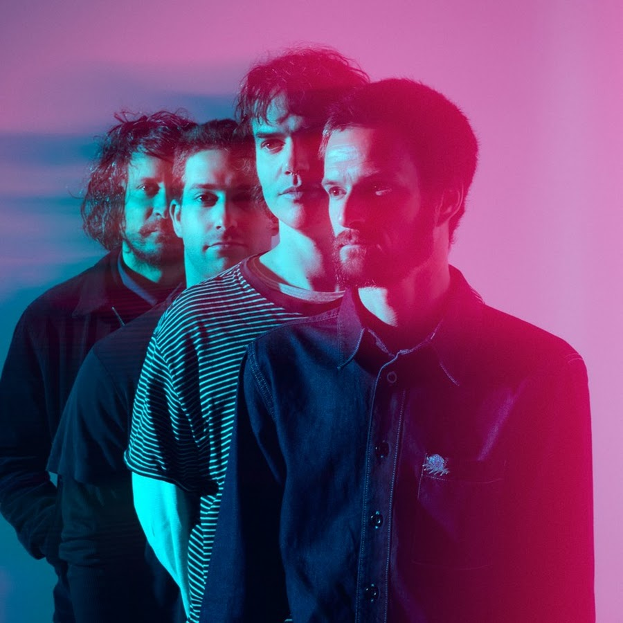
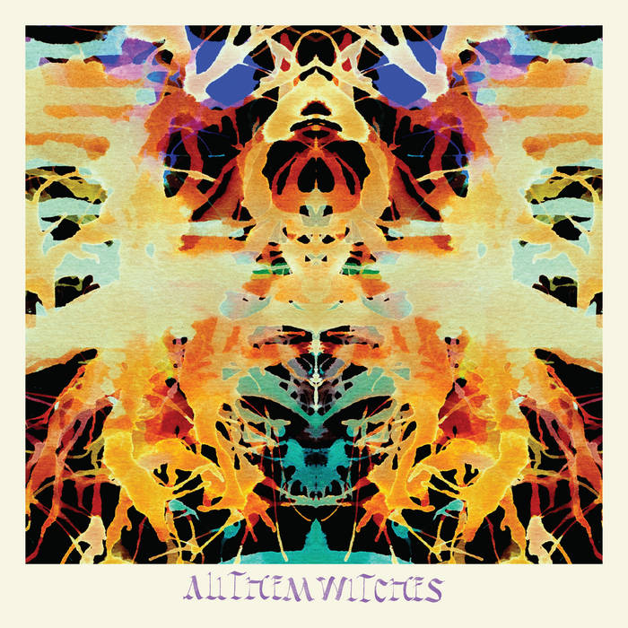
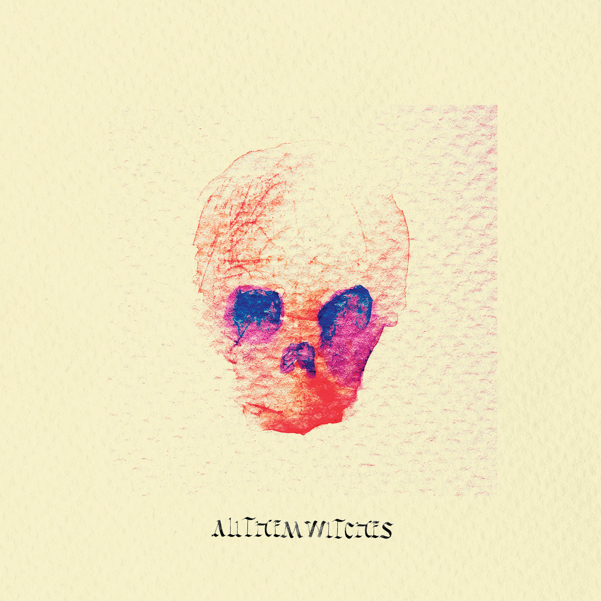
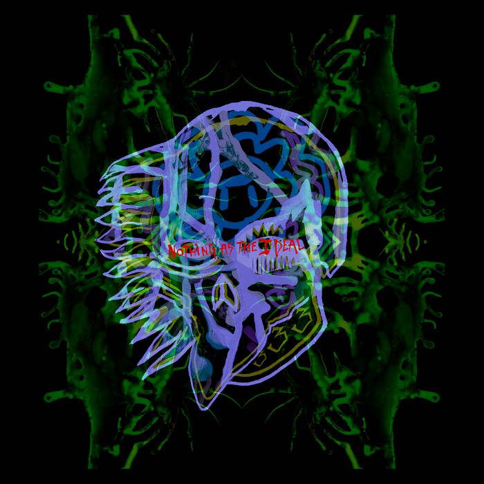

---
format:
  dashboard:
    orientation: columns
    theme: quartz
    scrolling: true
---

```{r imports}
library(plotly)
library(tidyverse)
library(compmus)
library(tidymodels)
library(ggdendro)
library(heatmaply)
```

```{r}
fourtyonedft <- read_csv("./dat/41dft.csv")
alltracks <- read_csv("./dat/computational_musicology_alltracks.csv") 
```

```{r setup, include=FALSE}
knitr::opts_chunk$set(echo = TRUE)
```

# Introduction {#Introduction}


## Column {width=55%}

### Row {height=25%}
::: {.card}

<div style="font-family:nunito; font-size:15px !important;">
Explore the sonic world of *All Them Witches* through a full analysis of their six studio albums. This project explores the evolution of the band's sound, from their early blues-inspired rock tracks, to more complex, psychedelic compositions.
</div>

:::


### Row {height=65% .tabset}

::: {.card title="History"}

<div style="font-family:nunito; font-size:15px !important;">
*All Them Witches* formed in 2012 in Nashville when drummer Robby Staebler recruited guitarist Ben McLeod, keyboardist Allan Van Cleave, and bassist/vocalist Charles Michael Parks Jr. That year, they self-released their first EP and debut album, *Our Mother Electricity*, which was later reissued by the German label Elektrohasch Records. In 2013, they self-released their second album, *Lightning at the Door*, before signing with New West Records in 2015. Under New West, the band released four albums, along with reissues of earlier albums.

Over the years, the band has seen minor lineup changes, including keyboardist Allan Van Cleave’s brief departure and eventual return. They have toured extensively across North America and Europe, steadily building their catalog and professional profile. Through independent releases, label partnerships, and consistent touring, All Them Witches have maintained an active presence in the modern rock scene since their formation.
</div>

:::

::: {.card title="Style"}

<div style="font-family:nunito; font-size:15px !important;">
*All Them Witches* blend psychedelic rock, blues, and stoner elements with hypnotic, atmospheric textures. Their music shifts seamlessly between fuzz-heavy, driving riffs and more mellow, acoustic passages, creating a dynamic and immersive sound. Recurring motifs, haunting melodies, and layered arrangements give the band a distinctive sonic identity that evolves across their discography.
</div>

:::


## Column



# Discography

## Column

### Row 

::: {.card title="&#32;"}


<p style="font-family:Computer Modern; font-size:20px;">
_Our Mother Electricity_<br>
</p>

<p style="font-family:Computer Modern; font-size:15px;">
Song list:<br>
1. Heavy/Like a Witch<br>
2. The Urn<br>
3. Bloodhounds<br>
4. Guns<br>
5. Elk.Blood.Heart<br>
6. Until It Unwinds<br>
7. Easy<br>
8. Family Song For The Leaving<br>
9. Right Hand<br>
10.I Can't Even See Myself<br>
</p>

:::

::: {.card title="&#32;"}


<p style="font-family:Computer Modern; font-size:20px;">
<em>Lightning At The Door</em><br>
</p>

<p style="font-family:Computer Modern; font-size:15px;">
Song list:<br>
1. Funeral for a Great Drunken Bird<br>
2. When God Comes Back<br>
3. The Marriage of Coyote Woman<br>
4. Swallowed by the Sea<br>
5. Charles William<br>
6. The Death of Coyote Woman<br>
7. Romany Dagger<br>
8. Mountain<br>
9. Romany Dagger (Remended)<br>
10.Surface-To-Air Whistle<br>
</p>


:::

::: {.card title="&#32;"}


<p style="font-family:Computer Modern; font-size:20px;">
<em>Dying Surfer Meets His Maker</em><br>
</p>

<p style="font-family:Computer Modern; font-size:15px;">
Song list:<br>
1. Call Me Star<br>
2. El Centro<br>
3. Dirt Preachers<br>
4. This Is Where It Falls Apart<br>
5. Mellowing<br>
6. Open Passageways<br>
7. Instrumental 2 (Welcome to the Caveman Future)<br>
8. Talisman<br>
9. Blood and Sand / Milk and Endless Waters<br>
</p>

:::

### Row

::: {.card title="&#32;"}



<p style="font-family:Computer Modern; font-size:20px;">
<em>Sleeping Through The War</em><br>
</p>

<p style="font-family:Computer Modern; font-size:15px;">
Song list:<br>
1. Bulls<br>
2. Don't Bring Me Coffee<br>
3. Bruce Lee<br>
4. 3-5-7<br>
5. Am I Going Up?<br>
6. Alabaster<br>
7. Cowboy Kirk<br>
8. Internet<br>
</p>

:::

::: {.card title="&#32;"}



<p style="font-family:Computer Modern; font-size:20px;">
<em>ATW</em><br>
</p>

<p style="font-family:Computer Modern; font-size:15px;">
Song list:<br>
1. Fishbelly 86 Onions<br>
2. Workhorse<br>
3. 1st vs. 2nd<br>
4. Half-Tongue<br>
5. Diamond<br>
6. Harvest Feast<br>
7. HJTC<br>
8. Rob's Dream<br>
</p>

:::

::: {.card title="&#32;"}



<p style="font-family:Computer Modern; font-size:20px;">
<em>Nothing as the Ideal</em><br>
</p>

<p style="font-family:Computer Modern; font-size:15px;">
Song list:<br>
1. Saturnine & Iron Jaw<br>
2. Enemy of My Enemy<br>
3. Everest<br>
4. See You Next Fall<br>
5. The Children of Coyote Woman<br>
6. 41<br>
7. Lights Out<br>
8. Rats in Ruin<br>
</p>

:::
# homework 

### Row {height=100%}

::: {.card title="Homework week 11"}
Shown on the right side is a dft tempogram of a track called 41 from the album Nothing as the Ideal by All Them Witches. This track is mostly stated to be around 120 bpm by multiple online sources. What's interesting about this song is the fact that the drums play a half-time feel, meaning the kick is played on the 1 of the beat and the snare on the 3. While the drum is playing half-time, the guitar and bass are playing eighth notes. This lead me to think that sonic visualiser would have problems analysing this piece of music. some value around 120 is visible in the plot, but the double value is far more noticeable. This makes me think that the bass and guitar parts are tracked by sonic visualiser to generate a bpm. 
:::

## Column

### Row {height=100%}

::: {.card title=}
```{r plot-chunk, echo=FALSE}
#| title: All them witches - 41 DFT
fourtyonedft |> 
  pivot_longer(-TIME, names_to = "tempo") |> 
  mutate(tempo = as.numeric(tempo)) |> 
  ggplot(aes(x = TIME, y = tempo, fill = value)) +
  geom_raster() +
  scale_fill_viridis_c(guide = "none") +
  labs(x = "Time (s)", y = "Tempo (BPM)") +
  theme_classic()
```
:::


## Column {width=50%}

### Row

::: {card}
```{r, echo=FALSE}
alltracks_juice <-
  recipe(
    `Track Name` ~
      Danceability +
      Energy +
      Loudness +
      Speechiness +
      Acousticness +
      Instrumentalness +
      Liveness +
      Valence +
      Tempo +
      `Duration (ms)`,
    data = alltracks
  ) |>
  step_center(all_predictors()) |>
  step_scale(all_predictors()) |> 
  prep(alltracks |> mutate(`Track Name` = str_trunc(`Track Name`, 36))) |>
  juice() |>
  column_to_rownames("Track Name")
```
```{r, echo=FALSE}
alltracks_dist <- dist(alltracks_juice, method = "euclidean")
```
```{r, echo=FALSE}
alltracks_dist |> 
  hclust(method = "complete") |> # Try single, average, and complete.
  dendro_data() |>
  ggdendrogram()
```
:::

::: {card}

```{r, echo=FALSE}
alltracks2_juice <-
  recipe(
    `Track Name` ~
      Energy +
      Loudness,
    data = alltracks
  ) |>
  step_center(all_predictors()) |>
  step_scale(all_predictors()) |> 
  prep(alltracks |> mutate(`Track Name` = str_trunc(`Track Name`, 36))) |>
  juice() |>
  column_to_rownames("Track Name")
```
```{r, echo=FALSE}
alltracks2_dist <- dist(alltracks2_juice, method = "euclidean")
```
```{r, echo=FALSE}
alltracks2_dist |> 
  hclust(method = "complete") |> # Try single, average, and complete.
  dendro_data() |>
  ggdendrogram()
```

:::

## Column

### Row {height=50%}

The first dendrogram to the left is made up of all songs used in the corpus. All variables as extracted from exportify are used. These are: danceability, energy, loudness, speechiness, acousticness, instrumentalness, liveness, valence and tempo. The clusters seem to make sense to some extent. clusters like the 2nd, 3rd, 4th, 5th and 6th track are quite similar in ways. They are all higher energy, mostly distorted sounding tracks. These kind of variables can be clustered even better.

### Row{height=50%}

The second dendrogram is also made up of all songs used in the corpus, but this time only energy and loudness are used. This makes the clusters as seen in the dendrogram to be more specific and therefore more logical to read and it is easier to make conclusions while listening. The interesting part about this dendogram is the fact that all clusters seem to have tracks from different albums, concluding that, with only these dendrograms, there is no reason to believe that the albums differ in energy and loudness level.
